# Assignment #1: 自主学习

Updated 1427 GMT+8 Sep 9, 2025

2025 fall, Complied by ==张真铭 元培学院==


**作业的各项评分细则及对应的得分**

| 标准                                 | 等级                                                         | 得分 |
| ------------------------------------ | ------------------------------------------------------------ | ---- |
| 按时提交                             | 完全按时提交：1分<br/>提交有请假说明：0.5分<br/>未提交：0分  | 1 分 |
| 源码、耗时（可选）、解题思路（可选） | 提交了4个或更多题目且包含所有必要信息：1分<br/>提交了2个或以上题目但不足4个：0.5分<br/>少于2个：0分 | 1 分 |
| AC代码截图                           | 提交了4个或更多题目且包含所有必要信息：1分<br/>提交了2个或以上题目但不足4个：0.5分<br/>少于：0分 | 1 分 |
| 清晰头像、PDF文件、MD/DOC附件        | 包含清晰的Canvas头像、PDF文件以及MD或DOC格式的附件：1分<br/>缺少上述三项中的任意一项：0.5分<br/>缺失两项或以上：0分 | 1 分 |
| 学习总结和个人收获                   | 提交了学习总结和个人收获：1分<br/>未提交学习总结或内容不详：0分 | 1 分 |
| 总得分： 5                           | 总分满分：5分                                                |      |

>
>
>
>**说明：**
>
>1. **解题与记录：**
>
>   对于每一个题目，请提供其解题思路（可选），并附上使用Python或C++编写的源代码（确保已在OpenJudge， Codeforces，LeetCode等平台上获得Accepted）。请将这些信息连同显示“Accepted”的截图一起填写到下方的作业模板中。（推荐使用Typora https://typoraio.cn 进行编辑，当然你也可以选择Word。）无论题目是否已通过，请标明每个题目大致花费的时间。
>
>2. **课程平台：**课程网站位于Canvas平台（https://pku.instructure.com ）。该平台将在<mark>第2周</mark>选课结束后正式启用。在平台启用前，请先完成作业并将作业妥善保存。待Canvas平台激活后，再上传你的作业。
>
>3. **提交安排：**提交时，请首先上传PDF格式的文件，并将.md或.doc格式的文件作为附件上传至右侧的“作业评论”区。确保你的Canvas账户有一个清晰可见的本人头像，提交的文件为PDF格式，并且“作业评论”区包含上传的.md或.doc附件。
>
>4. **延迟提交：****如果你预计无法在截止日期前提交作业，请提前告知具体原因。这有助于我们了解情况并可能为你提供适当的延期或其他帮助。  
>
>请按照上述指导认真准备和提交作业，以保证顺利完成课程要求。


## 1. 题目

### E02733: 判断闰年

http://cs101.openjudge.cn/pctbook/E02733/


思路：


代码

```cpp
#include <iostream>
using namespace std;

int main()
{
    int a;
    cin >> a;
    if (a % 4 == 0)
        if (a % 100 == 0 && a % 400 != 0) cout << "N" << endl;
        else if (a % 3200 == 0) cout << "N" << endl;
        else cout << "Y" << endl;
    else cout << "N" << endl;
    return 0;
}
```


代码运行截图 ==（至少包含有"Accepted"）==

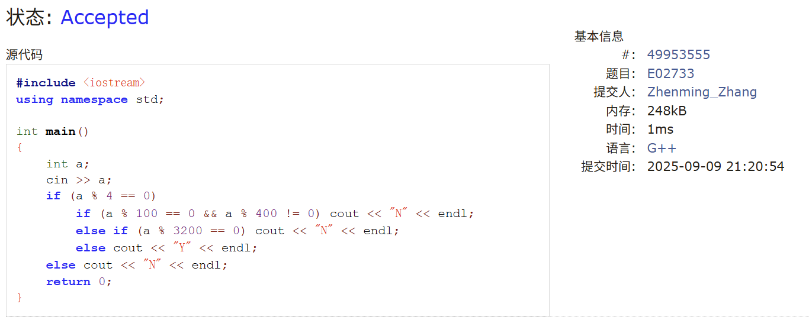
>共用时5分钟


### E02750: 鸡兔同笼

http://cs101.openjudge.cn/pctbook/E02750/


思路：


代码

```cpp
#include <iostream>
using namespace std;

int main()
{
    int a;
    int maxNum = 0, minNum = 0;
    cin >> a;
    if (a % 2 != 0)
    {
        cout << 0 << " " << 0 << endl;
        return 0;
    }
    maxNum += a / 2;
    minNum += a / 4;
    minNum += a % 4 / 2;
    cout << minNum << " " << maxNum << endl;
    return 0;
}
```


代码运行截图 ==（至少包含有"Accepted"）==

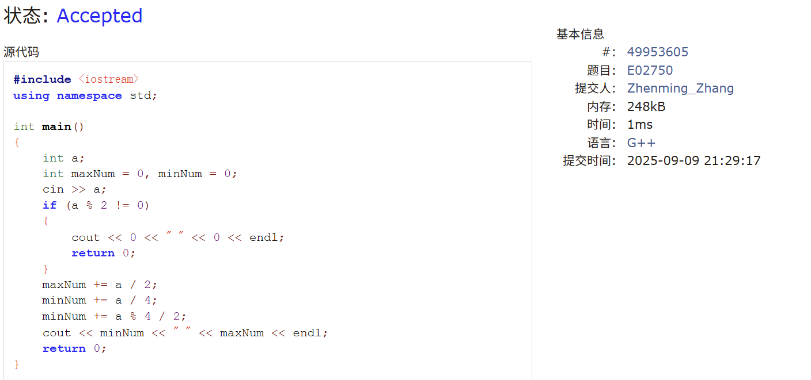
>共用时4分钟


### 50A. Domino piling

greedy, math, 800, http://codeforces.com/problemset/problem/50/A


思路：


代码

```cpp
#include <iostream>
using namespace std;

int main()
{
    int M, N;
    cin >> M >> N;
    cout << M * N / 2 << endl;
    return 0;
}
```


代码运行截图 ==（至少包含有"Accepted"）==

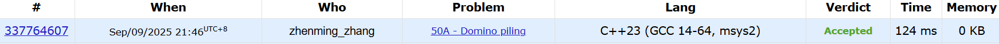
>共用时2分钟


### 1A. Theatre Square

math, 1000, https://codeforces.com/problemset/problem/1/A


思路：
注意数据范围，要开long long！

代码

```cpp
#include <iostream>
using namespace std;

int main()
{
    long long n, m, a;
    cin >> n >> m >> a;
    cout << ((n + a - 1) / a) * ((m + a - 1) / a) << endl;
    return 0;
}
```


代码运行截图 ==（至少包含有"Accepted"）==

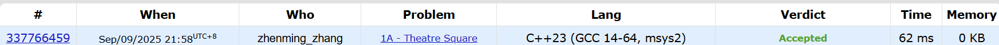
>共用时4分钟


### 112A. Petya and Strings

implementation, strings, 1000, http://codeforces.com/problemset/problem/112/A


思路：
使用STL转换大小写，利用ASCII码进行大小比较。另外要明确字典顺序的概念。


代码

```cpp
#include <iostream>
#include <algorithm>
#include <string>
using namespace std;

int main()
{
    string str1, str2;
    cin >> str1 >> str2;
    transform(str1.begin(), str1.end(), str1.begin(), ::towlower);
    transform(str2.begin(), str2.end(), str2.begin(), ::towlower);
    for (int i = 0; i < str1.size(); i++)
    {
        if (str1[i] > str2[i])
        {
            cout << 1 << endl;
            return 0;
        }
        if (str1[i] < str2[i])
        {
            cout << -1 << endl;
            return 0;
        }
    }
    cout << 0 << endl;
    return 0;
}
```


代码运行截图 ==（至少包含有"Accepted"）==

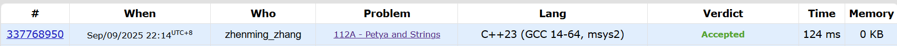
>共用时10分钟


### 231A. Team

bruteforce, greedy, 800, http://codeforces.com/problemset/problem/231/A


思路：


代码

```cpp
#include <iostream>
using namespace std;

int main()
{
    int n;
    int problem_to_be_solved = 0;
    cin >> n;
    for (int i = 0; i < n; i++)
    {
        int a, b, c;
        cin >> a >> b >> c;
        if (a == b && a == 1 || b == c && b == 1 || c == a && c == 1) problem_to_be_solved++;
    }
    cout << problem_to_be_solved << endl;
    return 0;
}
```


代码运行截图 ==（至少包含有"Accepted"）==

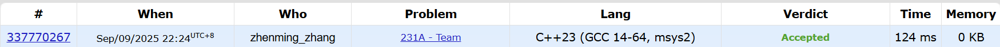
>共用时5分钟


## 2. 学习总结和收获
==如果作业题目简单，有否额外练习题目，比如：OJ“计概2025fall每日选做”、CF、LeetCode、洛谷等网站题目。==

均为简单的数学题，模拟成分很少，作为语法训练题和打字速度练习（？）。
所以加练了每日选做，感觉string的题不太熟练，但是STL太全面了，很多处理直接用函数就能解决。

### E01218:THE DRUNK JAILER

math, implementation, http://cs101.openjudge.cn/pctbook/E01218/

代码
```cpp
#include <iostream>
using namespace std;

int main()
{
    int a;
    cin >> a;
    for (int i = 0; i < a; i++)
    {
        int n;
        bool cell[101] = {false};
        cin >> n;
        for (int j = 1; j <= n; j++)
            for (int k = j; k <= n; k += j)
            {
                if (cell[k] == true) cell[k] = false;
                else cell[k] = true;
            }
        int cnt = 0;
        for (int j = 1; j <= n; j++)
            if (cell[j] == true)
                cnt++;
        cout << cnt << endl;
    }
    return 0;
}
```

代码运行截图 ==（至少包含有"Accepted"）==

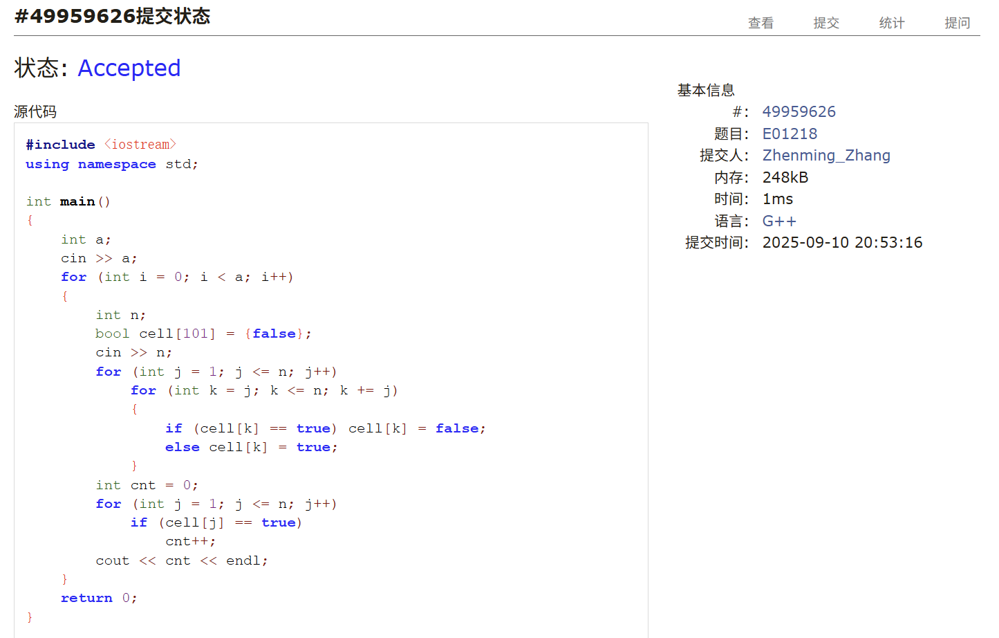

### 1352A. Sum of Round Numbers

implementation, math, 800, https://codeforces.com/problemset/problem/1352/A

代码
```cpp
#include <iostream>
#include <cmath>
using namespace std;
int main()
{
    int n;
    cin >> n;
    for (int i = 0; i < n; i++)
    {
        int num, b;
        int a = 1, cnt = 0;
        int round[6];
        cin >> num;
        do
        {
            b = pow(10, a);
            if (num % b != 0)
                round[cnt++] = num % b;
            num -= num % b;
            a++;
        } while (num != 0);
        cout << cnt << endl;
        for (int i = 0; i < cnt; i++)
            cout << round[i] << " ";
        cout << endl;
    }
    return 0;
}
```

代码运行截图 ==（至少包含有"Accepted"）==

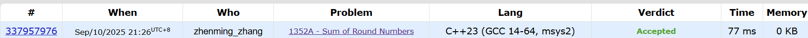

### E03143: 验证“歌德巴赫猜想”

math, Easy, http://cs101.openjudge.cn/pctbook/E03143/

代码

```cpp
#include <iostream>
using namespace std;

bool is_prime(int x)
{
    if (x < 2)
        return false;
    for (int i = 2; i < x; i++)
        if (x % i == 0) return false;
    return true;
}

int main()
{
    int n;
    cin >> n;
    if (n < 6 || n % 2 != 0)
    {
        cout << "Error!" << endl;
        return 0;
    }
    for (int i = 3; i <= n / 2; i++)
    {
        int j = n - i;
        if (is_prime(i) && is_prime(j))
            cout << n << "=" << i << "+" << j << endl;
    }
    return 0;
}
```

代码运行截图 ==（至少包含有"Accepted"）==

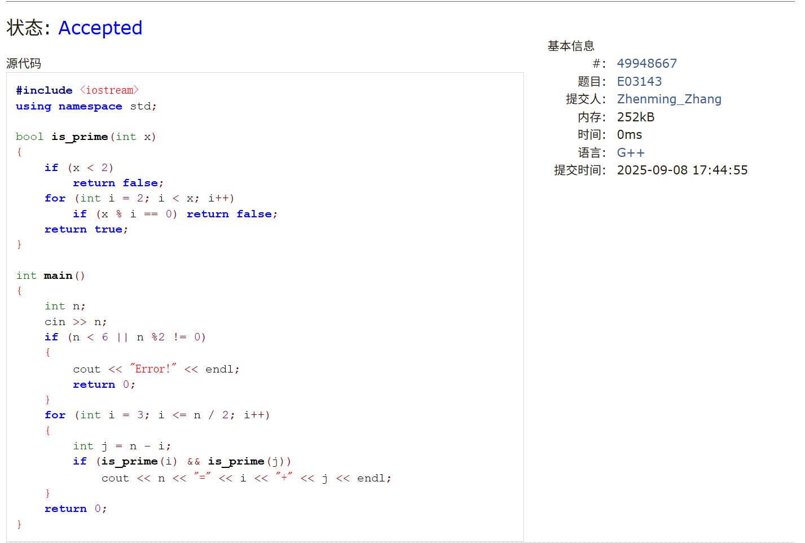

### M19944: 这一天星期几

math, Medium, http://cs101.openjudge.cn/pctbook/M19944/

代码

```cpp
#include <iostream>
#include <cmath>
using namespace std;

int main()
{
    int n;
    cin >> n;
    for (int i = 0; i < n; i++)
    {
        int input;
        cin >> input;
        int c = input / 1000000;
        int y = input % 1000000 / 10000;
        int d = input % 100;
        int m;
        if (input % 10000 / 100 == 1 || input % 10000 / 100 == 2)
        {
            m = input % 10000 / 100 + 12;
            y -= 1;
        }
        else
            m = input % 10000 / 100;
        if (y == -1)
        {
            c -= 1;
            y = 99;
        }
        int w = ((y + y / 4 + c / 4 - 2 * c + (13 * (m + 1)) / 5 + d - 1) + 700) % 7;
        switch (w)
        {
        case 1:
            cout << "Monday" << endl;
            break;
        case 2:
            cout << "Tuesday" << endl;
            break;
        case 3:
            cout << "Wednesday" << endl;
            break;
        case 4:
            cout << "Thursday" << endl;
            break;
        case 5:
            cout << "Friday" << endl;
            break;
        case 6:
            cout << "Saturday" << endl;
            break;
        case 0:
            cout << "Sunday" << endl;
            break;
        }
    }
    return 0;
}
```

代码运行截图 ==（至少包含有"Accepted"）==

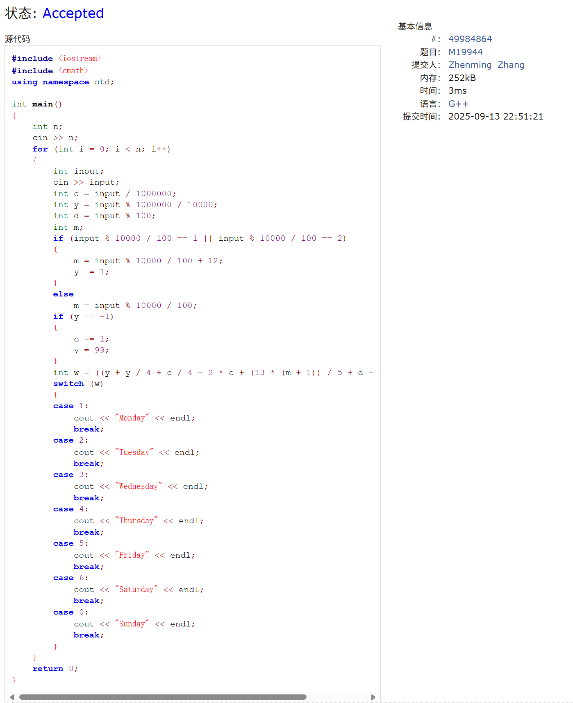

### 1475A. Odd Divisor

math, number theory, 900, https://codeforces.com/problemset/problem/1475/A

代码
```cpp
#include <iostream>
using namespace std;

bool judgement(unsigned long long a)
{
    if (a == 1)
        return false;
    while (a % 2 == 0)
        a /= 2;
    if (a > 1)
        return true;
    else
        return false;
}

int main()
{
    int t;
    cin >> t;
    for (int i = 0; i < t; i++)
    {
        unsigned long long n;
        cin >> n;
        if (judgement(n))
            cout << "YES" << endl;
        else
            cout << "NO" << endl;
    }
    return 0;
}
```

代码运行截图 ==（至少包含有"Accepted"）==

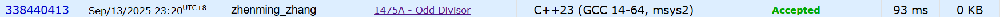

### M01002: 方便记忆的电话号码

sortings, hash table, Medium, http://cs101.openjudge.cn/pctbook/M01002/

代码
```cpp
#include <iostream>
#include <algorithm>
#include <map>
using namespace std;

int main()
{
    int n;
    map<string, int> num_cnt;
    cin >> n;
    for (int i = 0; i < n; i++)
    {
        string phone_num;
        cin >> phone_num;
        int pos = 0;
        while ((pos = phone_num.find('-', pos)) != string::npos)
            phone_num.erase(phone_num.begin() + pos);
        phone_num.insert(phone_num.begin() + 3, '-');
        transform(phone_num.begin(), phone_num.end(), phone_num.begin(), ::towupper);
        for (int j = 0; j < phone_num.size(); j++)
        {
            switch(phone_num[j])
            {
                case 'A':
                case 'B':
                case 'C':
                    phone_num[j] = '2';
                    break;
                case 'D':
                case 'E':
                case 'F':
                    phone_num[j] = '3';
                    break;
                case 'G':
                case 'H':
                case 'I':
                    phone_num[j] = '4';
                    break;
                case 'J':
                case 'K':
                case 'L':
                    phone_num[j] = '5';
                    break;
                case 'M':
                case 'N':
                case 'O':
                    phone_num[j] = '6';
                    break;
                case 'P':
                case 'R':
                case 'S':
                    phone_num[j] = '7';
                    break;
                case 'T':
                case 'U':
                case 'V':
                    phone_num[j] = '8';
                    break;
                case 'W':
                case 'X':
                case 'Y':
                    phone_num[j] = '9';
                    break;
            }
        }
        num_cnt[phone_num]++;
    }
    bool is_empty = false;
    for (const auto& pair : num_cnt)
        if (pair.second > 1)
        {
            cout << pair.first << " " << pair.second << endl;
            is_empty = 1;
        }
    if (is_empty == false)
        cout << "No duplicates." << endl;
    return 0;
}
```
代码运行截图 ==（至少包含有"Accepted"）==

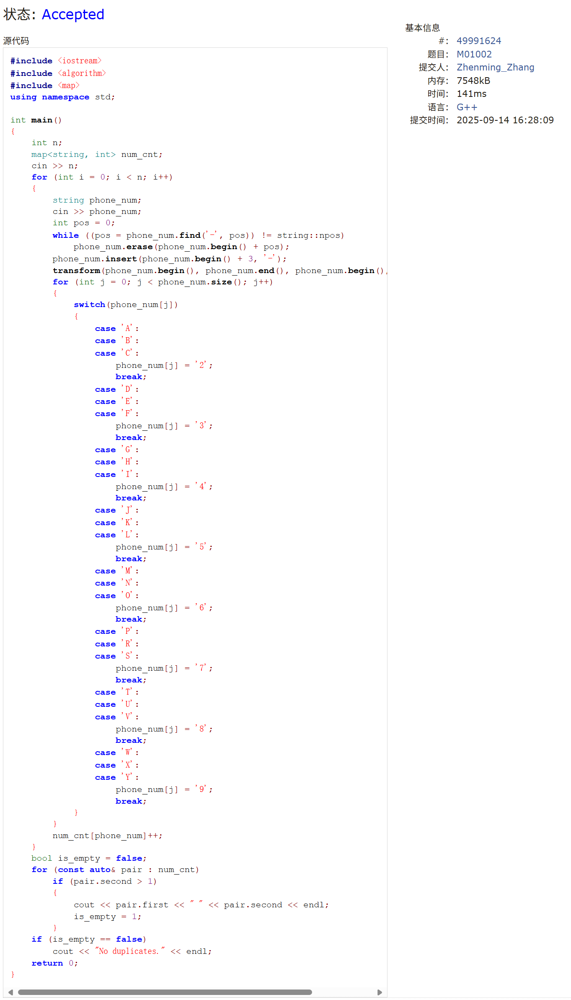

### 160A. Twins

greedy, sortings, 900, https://codeforces.com/problemset/problem/160/A

代码
```cpp
#include <iostream>
#include <algorithm>
using namespace std;

bool cmp(int a, int b)
{
    return a > b;
}

int main()
{
    int n;
    int sum = 0, sum1 = 0, sum2 = 0;
    int a[101];
    cin >> n;
    for (int i = 0; i < n; i++)
    {
        cin >> a[i];
        sum += a[i];
    }
    sort(a, a + n, cmp);
    for (int i = 0; i < n; i++)
    {
        sum1 += a[i];
        sum2 = sum - sum1;
        if (sum1 > sum2)
        {
            cout << i + 1 << endl;
            return 0;
        }
    }
}
```

代码运行截图 ==（至少包含有"Accepted"）==

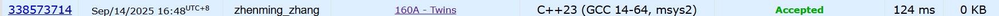

### M04015: 邮箱验证

```cpp
#include <iostream>
#include <cstring>
using namespace std;

int main()
{
    string eMail;
    while (cin >> eMail)
    {
        if (eMail[0] == '@' || eMail.back() == '@' || eMail[0] == '.' || eMail.back() == '.')
        {
            cout << "NO" << endl;
            continue;
        }
        int pos = 0, lpos;
        int cnt = 0;
        while ((pos = eMail.find('@', pos)) != string::npos)
        {
            eMail.erase(eMail.begin() + pos);
            cnt++;
            if (cnt > 1)
                continue;
            lpos = pos;
        }
        if (cnt > 1 || cnt == 0)
        {
            cout << "NO" << endl;
            continue;
        }
        if (eMail.find('.', lpos) == string::npos || eMail[lpos] == '.' || eMail[lpos - 1] == '.')
        {
            cout << "NO" << endl;
            continue;
        }
        cout << "YES" << endl;
    }
    return 0;
}
```
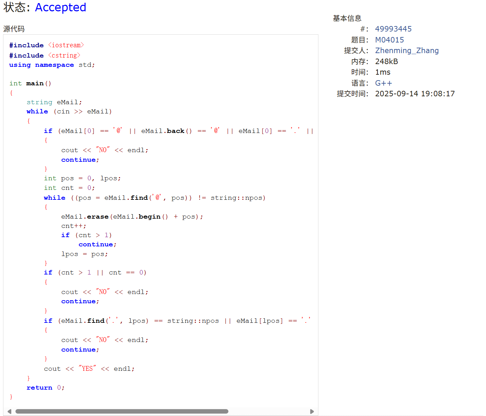

### 96A. Football

```cpp
#include <iostream>
#include <cstring>
using namespace std;

int main()
{
    string footBall;
    cin >> footBall;
    if (footBall.find("0000000", 0) != string::npos || footBall.find("1111111", 0) != string::npos)
        cout << "YES" << endl;
    else
        cout << "NO" << endl;
    return 0;
}
```

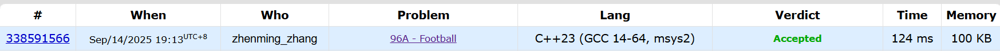

### E02910: 提取数字
唐题，单走一个2都是连续数字:( 题干有问题要改
```cpp
#include <iostream>
#include <cstring>
using namespace std;

int main()
{
    string str;
    cin >> str;
    for (int i = 0; i < str.size();)
    {
        if (str[i] >= '0' && str[i] <= '9')
        {
            string number = "";
            while(str[i] >= '0' && str[i] <= '9')
            {
                number += str[i];
                i++;
            }
                cout << stoi(number) << endl;
        }
        else i++;
    }
    return 0;
}
```

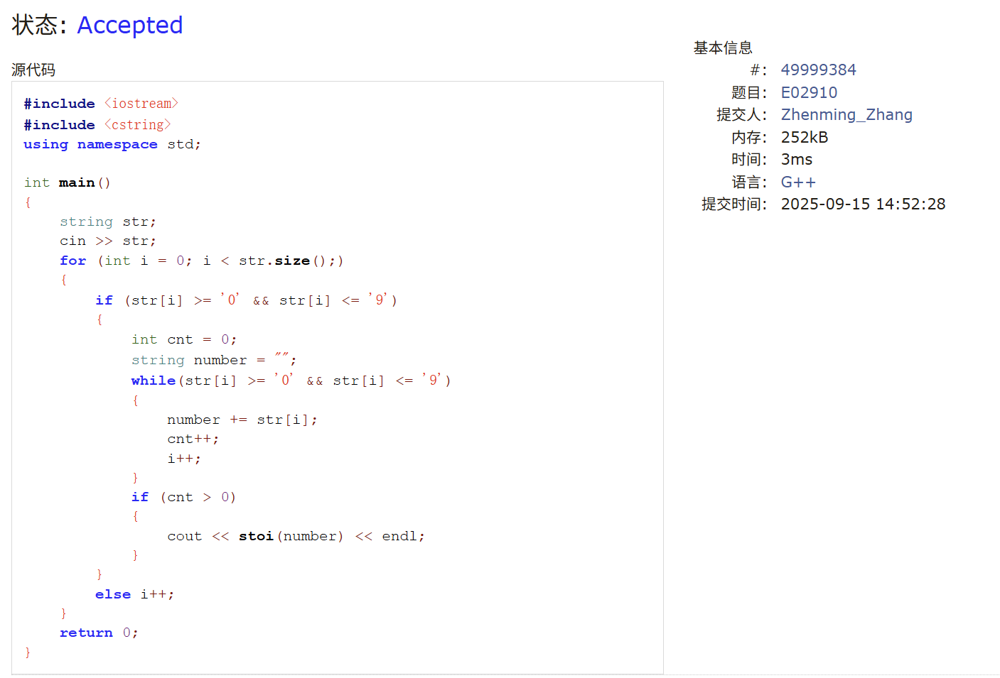

### 1879B. Chips on the Board
```cpp
#include <iostream>
#include <cmath>
#include <algorithm>
using namespace std;

int main()
{
    int t, n;
    cin >> t;
    while (t--)
    {
        cin >> n;
        int a[n], b[n];
        for (int j = 0; j < n; j++)
            cin >> a[j];
        for (int j = 0; j < n; j++)
            cin >> b[j];

        sort(a, a + n);
        sort(b, b + n);

        long long sum1 = 0, sum2 = 0;
        for (int j = 0; j < n; j++)
            sum1 += a[j] + b[0];
        for (int j = 0; j < n; j++)
            sum2 += a[0] + b[j];

        cout << min(sum1, sum2) << endl;
    }
    return 0;
}
```

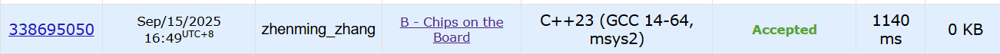