# Assignment #2: 语法练习

Updated 1335 GMT+8 Sep 16, 2025

2025 fall, Complied by <mark>同学的姓名、院系</mark>


**作业的各项评分细则及对应的得分**

| 标准                                 | 等级                                                         | 得分 |
| ------------------------------------ | ------------------------------------------------------------ | ---- |
| 按时提交                             | 完全按时提交：1分<br/>提交有请假说明：0.5分<br/>未提交：0分  | 1 分 |
| 源码、耗时（可选）、解题思路（可选） | 提交了4个或更多题目且包含所有必要信息：1分<br/>提交了2个或以上题目但不足4个：0.5分<br/>少于2个：0分 | 1 分 |
| AC代码截图                           | 提交了4个或更多题目且包含所有必要信息：1分<br/>提交了2个或以上题目但不足4个：0.5分<br/>少于：0分 | 1 分 |
| 清晰头像、PDF文件、MD/DOC附件        | 包含清晰的Canvas头像、PDF文件以及MD或DOC格式的附件：1分<br/>缺少上述三项中的任意一项：0.5分<br/>缺失两项或以上：0分 | 1 分 |
| 学习总结和个人收获                   | 提交了学习总结和个人收获：1分<br/>未提交学习总结或内容不详：0分 | 1 分 |
| 总得分： 5                           | 总分满分：5分                                                |      |

>
>
>
>**说明：**
>
>1. **解题与记录：**
>
>   对于每一个题目，请提供其解题思路（可选），并附上使用Python或C++编写的源代码（确保已在OpenJudge， Codeforces，LeetCode等平台上获得Accepted）。请将这些信息连同显示“Accepted”的截图一起填写到下方的作业模板中。（推荐使用Typora https://typoraio.cn 进行编辑，当然你也可以选择Word。）无论题目是否已通过，请标明每个题目大致花费的时间。
>
>2. **课程平台：**课程网站位于Canvas平台（https://pku.instructure.com ）。该平台将在<mark>第2周</mark>选课结束后正式启用。在平台启用前，请先完成作业并将作业妥善保存。待Canvas平台激活后，再上传你的作业。
>
>3. **提交安排：**提交时，请首先上传PDF格式的文件，并将.md或.doc格式的文件作为附件上传至右侧的“作业评论”区。确保你的Canvas账户有一个清晰可见的本人头像，提交的文件为PDF格式，并且“作业评论”区包含上传的.md或.doc附件。
>
>4. **延迟提交：**如果你预计无法在截止日期前提交作业，请提前告知具体原因。这有助于我们了解情况并可能为你提供适当的延期或其他帮助。  
>
>请按照上述指导认真准备和提交作业，以保证顺利完成课程要求。


## 1. 题目

### 263A. Beautiful Matrix

implementation, 800, https://codeforces.com/problemset/problem/263/A


思路：


代码

```cpp
#include <iostream>
#include <cmath>
using namespace std;

int main()
{
    int n;
    int x, y;
    for (int i = 0; i < 5; i++)
        for (int j = 0; j < 5; j++)
        {
            cin >> n;
            if (n == 1)
            {
                x = i;
                y = j;
            }
        }
    cout << abs(x - 2) + abs(y - 2) << endl;
    return 0;
}

```

>共用时5min

代码运行截图 <mark>（至少包含有"Accepted"）</mark>

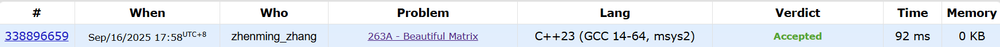


### 1328A. Divisibility Problem

math, 800, https://codeforces.com/problemset/problem/1328/A


思路：


代码

```cpp
#include <iostream>
using namespace std;

int main()
{
    int t;
    cin >> t;
    for (int i = 0; i < t; i++)
    {
        int a, b;
        cin >> a >> b;
        if (a % b == 0)
            cout << 0 << endl;
        else
            cout << b * (a / b + 1) - a << endl;
    }
    return 0;
}

```

>共用时5min

代码运行截图 <mark>（至少包含有"Accepted"）</mark>

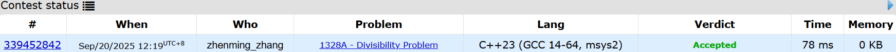


### 427A. Police Recruits

implementation, 800, https://codeforces.com/problemset/problem/427/A


思路：用了一个比较省力的方法，用while扫描替代了计数器，缺点是需要写判定语句，要考虑多种情况


代码

```cpp
#include <iostream>
using namespace std;

int main()
{
    int n;
    int i = 0, crime = 0;
    int event[100001];
    cin >> n;
    for (int i = 0; i < n; i++)
        cin >> event[i];
    for (int i = n - 1; i >= 0;)
    {
        while (i > 0)
        {
            if (event[i] != -1)
                break;
            crime += event[i];
            i--;
        }
        if (crime <= 0)
            crime += event[i];
        if (crime > 0)
            crime = 0;
        i--;
    }
    
    cout << -crime << endl;
    return 0;
}

```

>共用时15min

代码运行截图 <mark>（至少包含有"Accepted"）</mark>

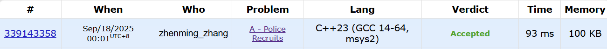


### E02808: 校门外的树

implementation, http://cs101.openjudge.cn/pctbook/E02808/


思路：NOIP经典，可以用数学方法做，也可以模拟


代码

```cpp
#include <iostream>
using namespace std;

int main()
{
    int L, M;
    cin >> L >> M;
    int tree[L + 1] = {0};
    for (int i = 0; i < M; i++)
    {
        int begin, end;
        cin >> begin >> end;
        for (int j = begin; j <= end; j++)
            tree[j] = 1;
    }
    int cnt = 0;
    for (int i = 0; i <= L; i++)
        if (tree[i] == 0)
            cnt++;
    cout << cnt << endl;
    return 0;
}
```

>共用时5min

代码运行截图 <mark>（至少包含有"Accepted"）</mark>

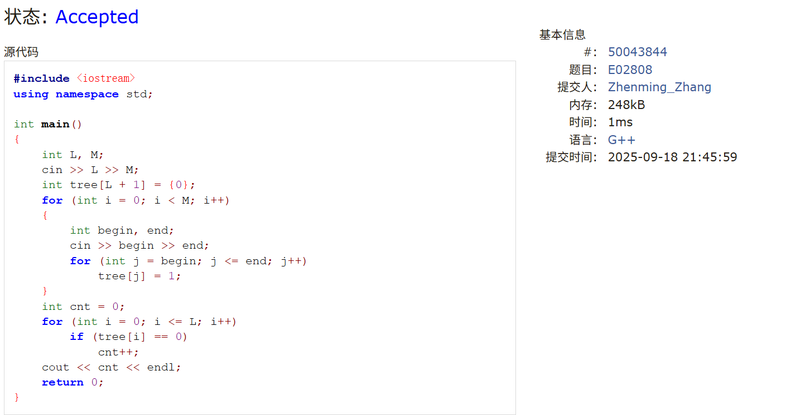


### sy60: 水仙花数II

implementation, https://sunnywhy.com/sfbj/3/1/60


思路：sunnywhy的输出检查太严格了


代码

```cpp
#include <iostream>
using namespace std;

int main()
{
    int a, b;
    cin >> a >> b;
    int cnt = 0;
    int ans[1000];
    for (int i = a; i <= b; i++)
    {
        int x = i / 100;
        int y = i % 100 / 10;
        int z = i % 10;
        if (x * x * x + y * y * y + z * z * z == i)
        {
            ans[cnt++] = i;
        }
    }
    if (cnt == 0)
        cout << "NO" << endl;
    else
        for (int i = 0; i < cnt; i++)
        {
            cout << ans[i];
            if (i != cnt - 1)
                cout << ' ';
        }
    return 0;
}

```

>共用时5min

代码运行截图 <mark>（至少包含有"Accepted"）</mark>


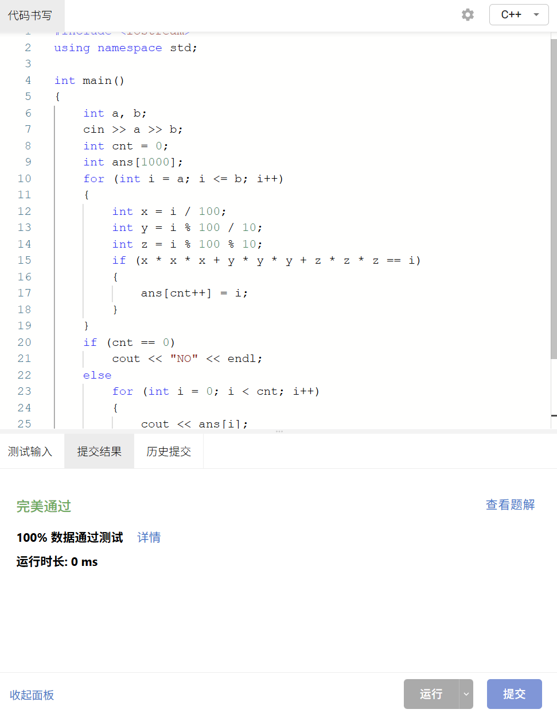


### M01922: Ride to School

implementation, http://cs101.openjudge.cn/pctbook/M01922/


思路：一个简单的数学题，虚假的题目分类“implementation”:(，最短的时间就是所有人中的最短用时，不考虑t < 0（因为追上了不用跟，追不上跟不了），类似某年的普及组题。（以及网页翻译坏事做尽，round up翻译成四舍五入）


代码

```cpp
#include <iostream>
#include <cmath>
using namespace std;

int main()
{
    int n;
    while (true)
    {
        cin >> n;
        if (n == 0)
            break;
        int minTime = 2147483647;
        for (int i = 0; i < n; i++)
        {
            double v, t;
            cin >> v >> t;
            if (t < 0)
                continue;
            else
                minTime = minTime < ceil(16200 / v) + t ? minTime : ceil(16200 / v) + t;
        }
        cout << minTime << endl;
    }
    return 0;
}
```
>共用时10min


代码运行截图 <mark>（至少包含有"Accepted"）</mark>


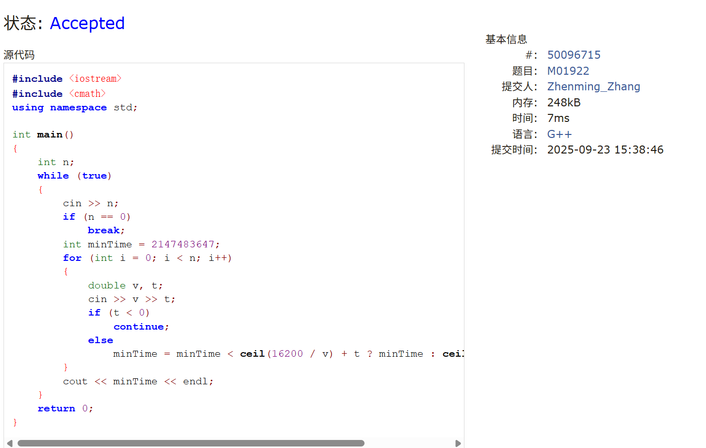


## 2. 学习总结和收获

<mark>如果作业题目简单，有否额外练习题目，比如：OJ“计概2025fall每日选做”、CF、LeetCode、洛谷等网站题目。</mark>

1. **依旧没有难题，每日选做甚至比作业还简单（）**，但是M02981:大整数加法这次使用了<mark>STL神力</mark>，使得码力消耗大大减少😋
2. **复习了一下上次做的题，万能的群u用了正则表达式做邮箱识别，但是我个人试了一下发现不是很好用**。毕竟判定条件比一般的邮箱松很多，导致regex会很复杂
3. String的用法回忆起来了很多，之前甚至连```string()```和```{a} + {b}```都不记得了......

### M04030

```cpp
#include <iostream>
#include <cstring>
#include <vector>
#include <algorithm>
using namespace std;

int main()
{
    string strFind;
    cin >> strFind;
    cin.ignore();
    string strText;
    getline(cin, strText);
    transform(strFind.begin(), strFind.end(), strFind.begin(), ::towlower);
    transform(strText.begin(), strText.end(), strText.begin(), ::towlower);
    int cnt = 0;
    int pos = 0, posFirst;
    while ((pos = strText.find(strFind, pos)) != string::npos)
    {
        if (pos == 0)
        {
            cnt ++;
            posFirst = pos;
        }
        else if ((strText[pos - 1] < 'a' || strText[pos - 1] > 'z') && (strText[pos + strFind.size()] < 'a' || strText[pos + strFind.size()] > 'z'))
        {
            cnt++;
            if (cnt == 1)
                posFirst = pos;
        }
        pos += strFind.size();
    }
    if (cnt == 0)
        cout << -1 << endl;
    else
    {
        cout << cnt << ' ' << posFirst << endl;
    }
    return 0;
}
```

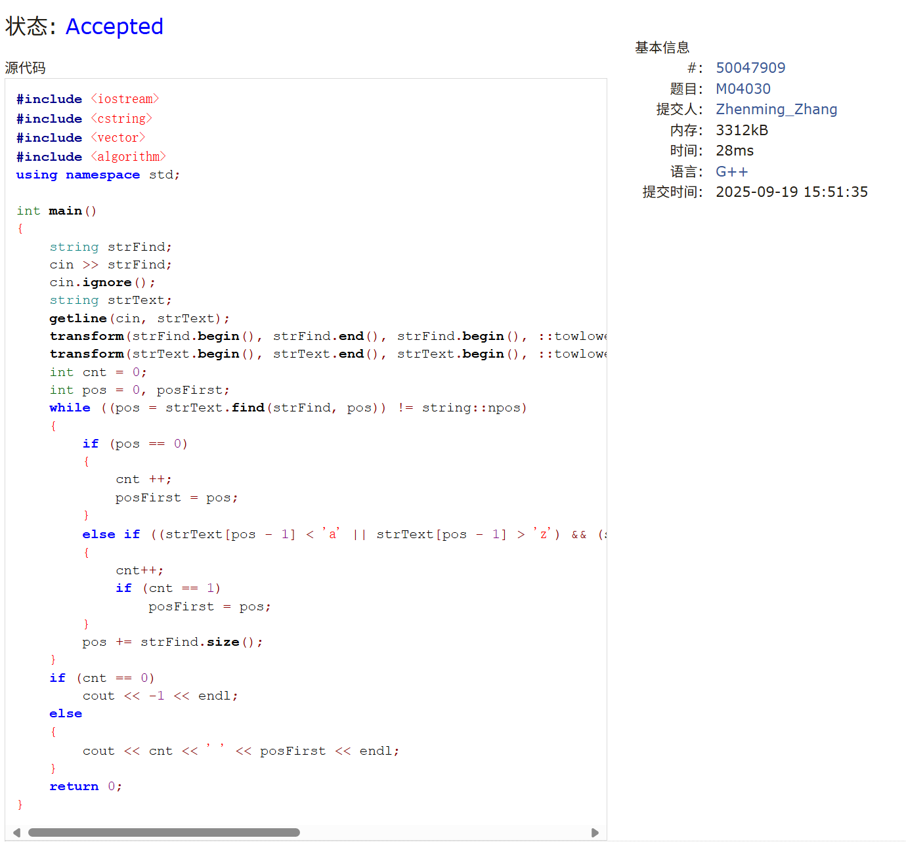

### 122A

```cpp
#include <iostream>
using namespace std;

int main()
{
    int t;
    cin >> t;
    for (int i = 0; i < t; i++)
    {
        int a;
        cin >> a;
        if (360 % (180 - a) == 0)
            cout << "YES" << endl;
        else
            cout << "NO" << endl;
    }
    return 0;
}
```

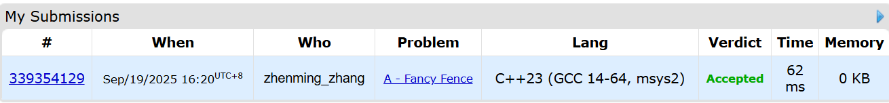

### M02981

```cpp
#include <iostream>
#include <string>
#include <algorithm>
using namespace std;

int main()
{
    string a, b;
    cin >> a >> b;

    int maxLen = max(a.length(), b.length());
    a = string(maxLen - a.length(), '0') + a;
    b = string(maxLen - b.length(), '0') + b;
    
    string result(maxLen, '0');
    int carry = 0;

    for (int i = maxLen - 1; i >= 0; i--)
    {
        int sum = (a[i] - '0') + (b[i] - '0') + carry;
        carry = sum / 10;
        result[i] = (sum % 10) + '0';
    }

    if (carry > 0)
        result = "1" + result;

    result.erase(0, result.find_first_not_of('0'));

    if (result.empty())
        result = "0";
        
    cout << result << endl;
    
    return 0;
}
```

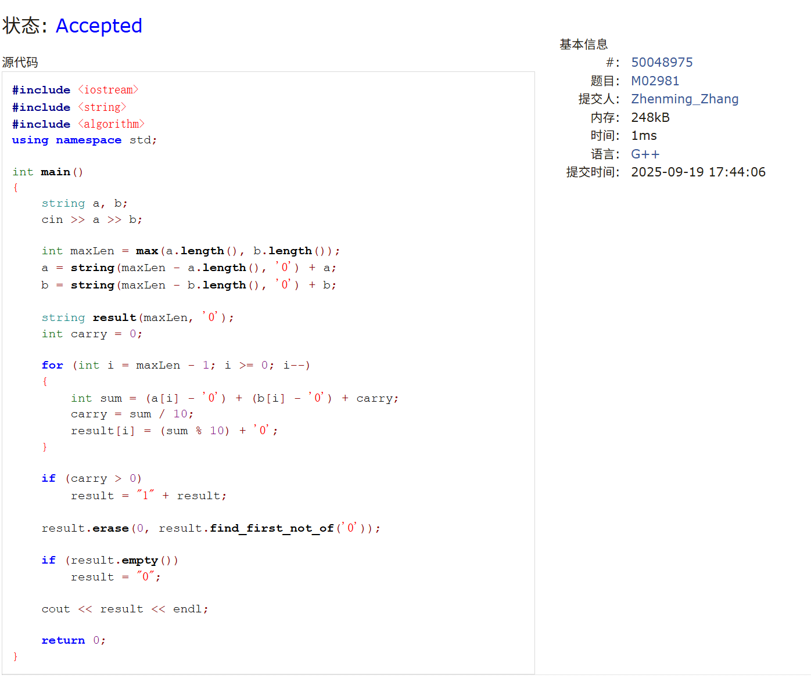

### sy56

```cpp
#include <iostream>
using namespace std;

int main()
{
    int n;
    cin >> n;
    int tmp = 0;
    for (int i = 0; i < n; i++)
    {
        int num;
        cin >> num;
        if (num < tmp)
        {
            cout << "NO" << endl;
            return 0;
        }
        tmp = num;
    }
    cout << "YES" << endl;
    return 0;
}
```

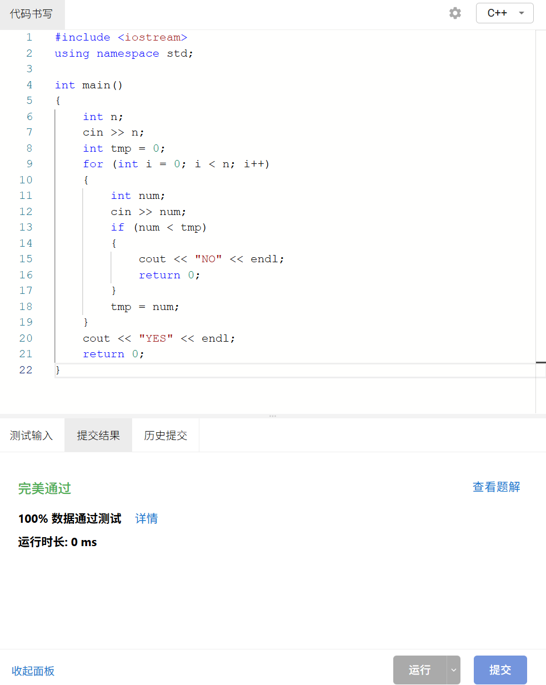

### M21532
```cpp
#include <iostream>
using namespace std;

int main()
{
    int sum;
    cin >> sum;
    for (int i = 6; i <= sum; i++)
    {
        if (sum % i == 0)
        {
            cout << sum / i << endl;
            return 0;
        }
    }
}
```
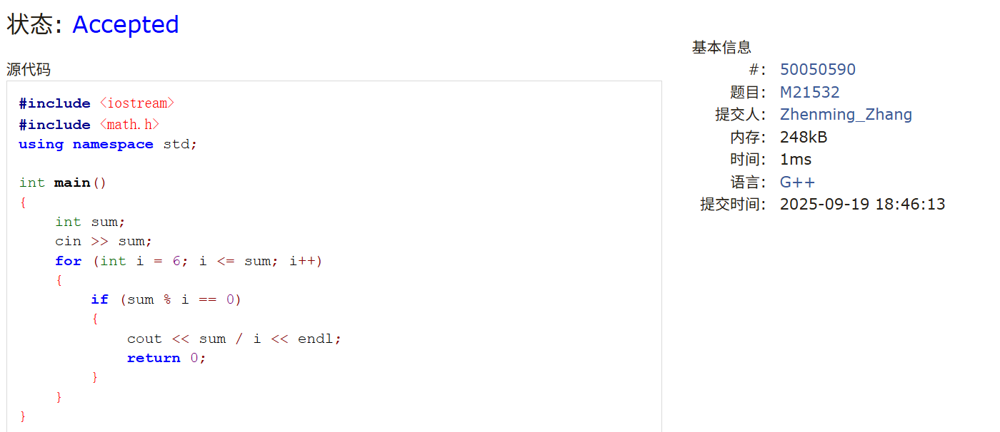

### E21459
```cpp
#include <iostream>
using namespace std;

int main()
{
    int n;
    cin >> n;
    while (true)
    {
        if (n % 2 == 0)
        {
            printf("%d/2=%d\n", n, n / 2);
            n /= 2;
        }
        else
        {
            printf("%d*3+1=%d\n", n, n * 3 + 1);
            n = n * 3 + 1;
        }
        if (n == 1)
            break;
    }
    return 0;
}
```

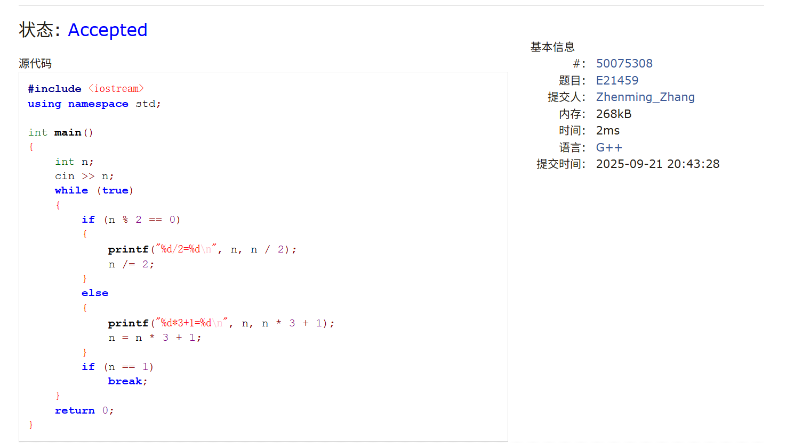

### sy64
```cpp
#include <iostream>
#include <vector>
using namespace std;

int main()
{
    int n;
    scanf("%d", &n);

    vector<int> a(n);
    for (int i = 0; i < n; i++)
        scanf("%d", &a[i]);
    
    int k;
    scanf("%d", &k);

    int cnt = 0;
    for (int i = 0; i < n - 1; i++)
        for (int j = i + 1; j < n; j++)
            if (a[i] + a[j] == k)
                cnt++;
    
    printf("%d", cnt);
    return 0;
}
```


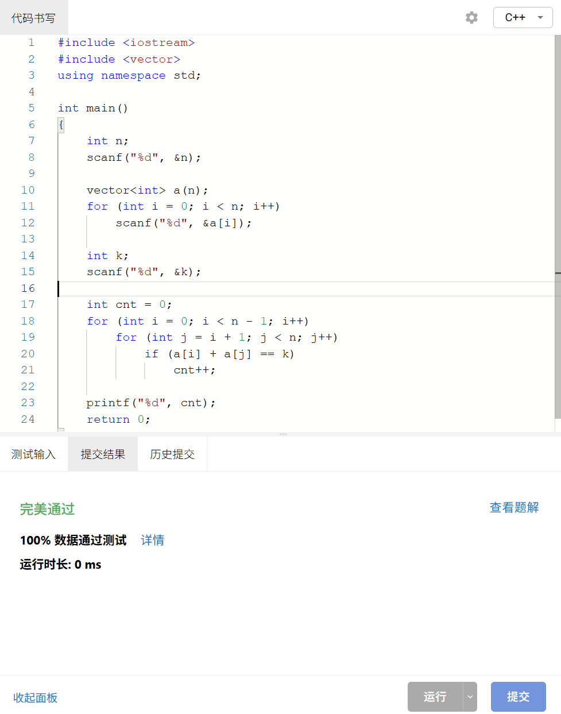