# Assignment #3: 语法练习

Updated 1440 GMT+8 Sep 23, 2025

2025 fall, Complied by <mark>同学的姓名、院系</mark>


>**说明：**
>
>1. **解题与记录：**
>
>  对于每一个题目，请提供其解题思路（可选），并附上使用Python或C++编写的源代码（确保已在OpenJudge， Codeforces，LeetCode等平台上获得Accepted）。请将这些信息连同显示“Accepted”的截图一起填写到下方的作业模板中。（推荐使用Typora https://typoraio.cn 进行编辑，当然你也可以选择Word。）无论题目是否已通过，请标明每个题目大致花费的时间。
>
>2. 提交安排：**提交时，请首先上传PDF格式的文件，并将.md或.doc格式的文件作为附件上传至右侧的“作业评论”区。确保你的Canvas账户有一个清晰可见的本人头像，提交的文件为PDF格式，并且“作业评论”区包含上传的.md或.doc附件。
> 
>4. **延迟提交：**如果你预计无法在截止日期前提交作业，请提前告知具体原因。这有助于我们了解情况并可能为你提供适当的延期或其他帮助。  
>
>请按照上述指导认真准备和提交作业，以保证顺利完成课程要求。


## 1. 题目

### E28674:《黑神话：悟空》之加密

http://cs101.openjudge.cn/pctbook/E28674/


思路：


代码

```cpp
#include <iostream>
using namespace std;

int main()
{
    int k;
    string password;
    cin >> k >> password;
    k = k % 26; 
    for (int i = 0; i < password.length(); i++)
    {
        if (password[i] >= 'A' && password[i] <= 'Z')
        {
            password[i] = (password[i] - 'A' - k + 26) % 26 + 'A';
        }
        else if (password[i] >= 'a' && password[i] <= 'z')
        {
            password[i] = (password[i] - 'a' - k + 26) % 26 + 'a';
        }
    }
    cout << password << endl;
    return 0;
}
```

>共用时5min

代码运行截图 <mark>（至少包含有"Accepted"）</mark>

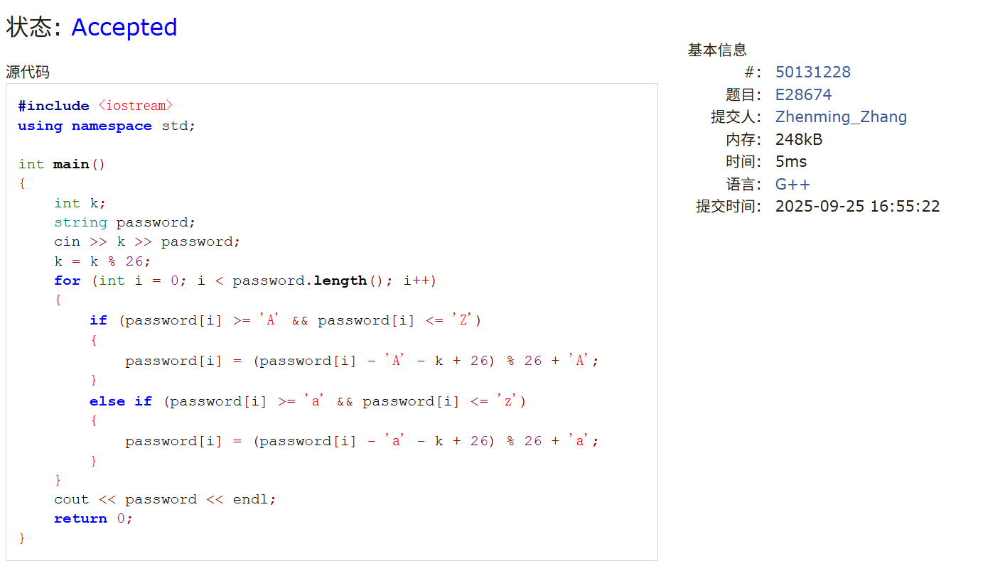


### E28691: 字符串中的整数求和

http://cs101.openjudge.cn/pctbook/E28691/


思路：


代码

```cpp
#include <iostream>
using namespace std;

int main()
{
    string a, b;
    cin >> a >> b;
    cout << stoi(a) + stoi(b) << endl;
    return 0;
}
```

>共用时30s


代码运行截图 <mark>（至少包含有"Accepted"）</mark>
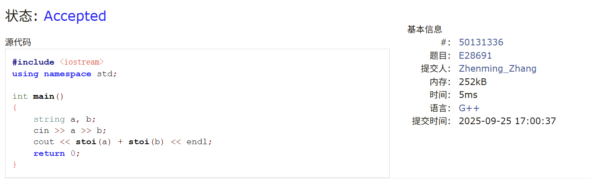


### M28664: 验证身份证号 

http://cs101.openjudge.cn/pctbook/M28664/


思路：打表，优化时间复杂度


代码

```cpp
#include <iostream>
using namespace std;

int main()
{
    int n;
    int c[17] = {7, 9, 10, 5, 8, 4, 2, 1, 6, 3, 7, 9, 10, 5, 8, 4, 2};
    char ref[11] = {'1', '0', 'X', '9', '8', '7', '6', '5', '4', '3', '2'};
    cin >> n;
    string ID;
    for (int i = 0; i < n; i++)
    {
        cin >> ID;
        int check = 0;
        for (int j = 0; j < ID.length() - 1; j++)
            check += (ID[j] - '0') * c[j];
        int l = check % 11;
        char end = ID.back();
        if (ref[l] == end)
            cout << "YES" << endl;
        else
            cout << "NO" << endl;
    }
    return 0;
}
```
>共用时5min


代码运行截图 <mark>（至少包含有"Accepted"）</mark>

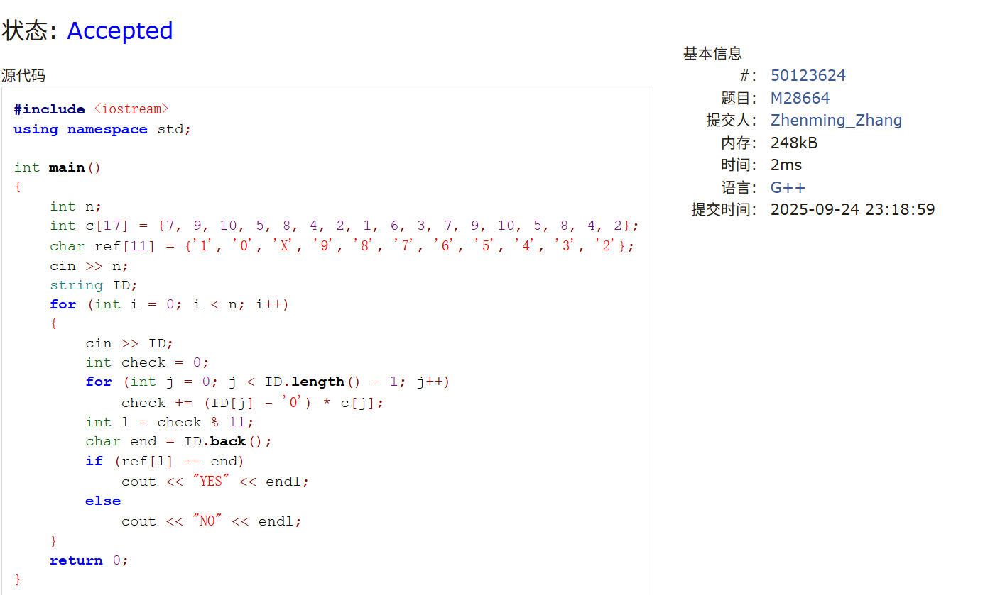


### M28678: 角谷猜想

http://cs101.openjudge.cn/pctbook/M28678/


思路：


代码

```cpp
#include <iostream>
using namespace std;

int main()
{
    int n;
    cin >> n;
    while (true)
    {
        if (n == 1)
            break;
        if (n % 2 == 0)
        {
            printf("%d/2=%d\n", n, n / 2);
            n /= 2;
        }
        else
        {
            printf("%d*3+1=%d\n", n, n * 3 + 1);
            n = n * 3 + 1;
        }
        if (n == 1)
            break;
    }
    cout << "End\n";
    return 0;
}
```

>共用时30s

代码运行截图 <mark>（至少包含有"Accepted"）</mark>

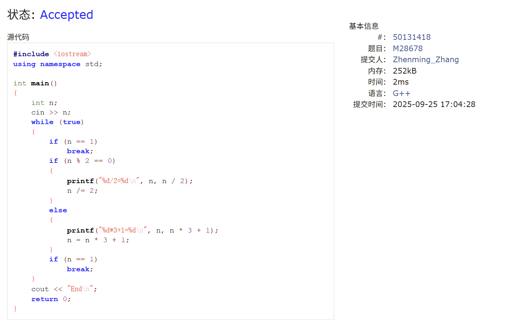


### M28700: 罗马数字与整数的转换

http://cs101.openjudge.cn/pctbook/M28700/


思路：模拟+打表，其实也可以纯打表做。一开始没想到映射方法，直接纯模拟，发现很难实现，然后打了个表就豁然开朗了


代码

```cpp
#include <iostream>
using namespace std;

string intToRoman(int input)
{
    string roman[] = {"M", "CM", "D", "CD", "C", "XC", "L", "XL", "X", "IX", "V", "IV", "I"};
    int num[] = {1000, 900, 500, 400, 100, 90, 50, 40, 10, 9, 5, 4, 1};
    string res;
    for (int i = 0; i < 13; i++)
        while (input >= num[i])
        {
            input -= num[i];
            res += roman[i];
        }
    return res;
}

int RomanToint(string input)
{
    int num[256];
    num['I'] = 1; num['V'] = 5; num['X'] = 10;
    num['L'] = 50; num['C'] = 100; num['D'] = 500; num['M'] = 1000;
    int res = num[input.back()];
    for (int i = input.length() - 2; i >= 0; i--)
        if (num[input[i]] >= num[input[i + 1]])
            res += num[input[i]];
        else
            res -= num[input[i]];
    return res;
}
int main()
{
    string input;
    cin >> input;
    if (input[0] >= '0' && input[0] <= '9')
        cout << intToRoman(stoi(input)) << endl;
    else
        cout << RomanToint(input) << endl;
    return 0;
}
```

>共用时1h

代码运行截图 <mark>（至少包含有"Accepted"）</mark>

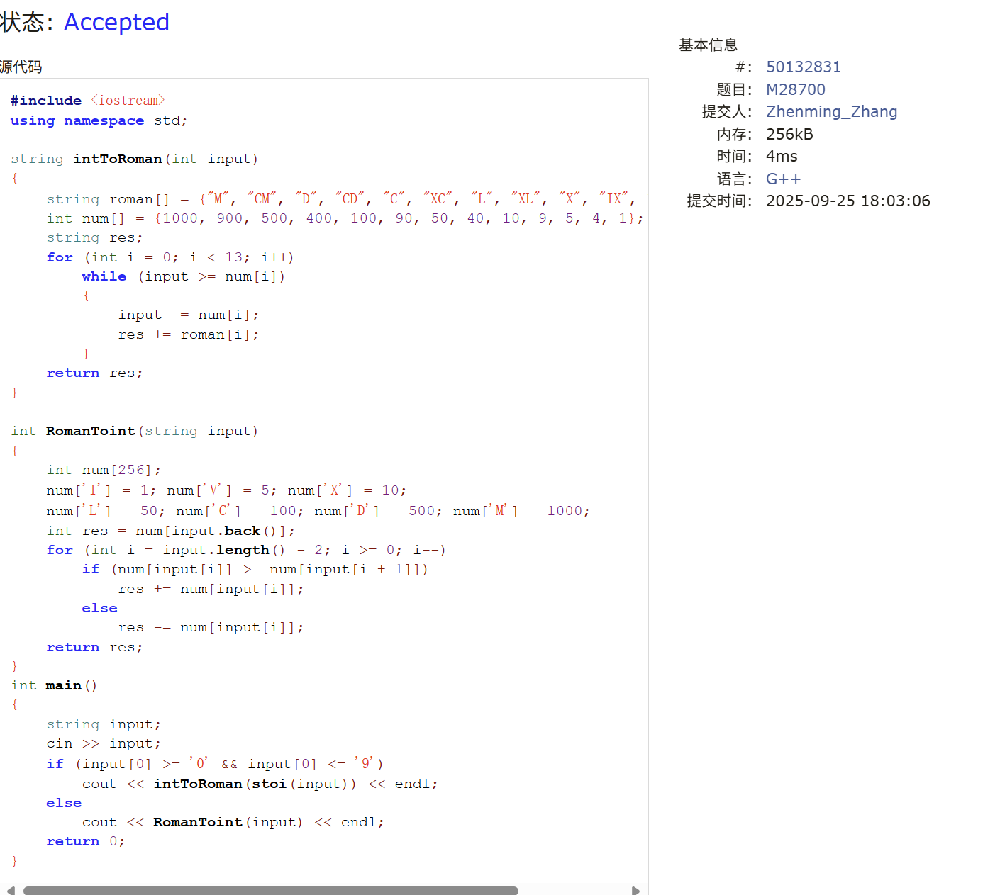


### 158B. Taxi

*special problem, greedy, implementation, 1100,  https://codeforces.com/problemset/problem/158/B


思路：


代码

```cpp
#include <iostream>
using namespace std;

int main()
{
    int n, input;
    cin >> n;
    int s[5] = {0};
    for (int i = 0; i < n; i++)
    {
        cin >> input;
        s[input]++;
    }
    int taxi = 0;
    
    taxi += s[4];

    taxi += s[3];
    s[1] -= s[3];
    if (s[1] < 0)
        s[1] = 0;
    
    taxi += s[2] / 2 + s[2] % 2;
    if (s[2] % 2 != 0)
        s[1] -= 2;
    if (s[1] < 0)
        s[1] = 0;
    
    taxi += s[1] / 4;
    if (s[1] % 4 > 0)
        taxi++;
    
    cout << taxi << endl;
    return 0;
}

```

>共用时10min

代码运行截图 <mark>（至少包含有"Accepted"）</mark>

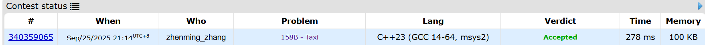


## 2. 学习总结和收获

<mark>如果作业题目简单，有否额外练习题目，比如：OJ“计概2025fall每日选做”、CF、LeetCode、洛谷等网站题目。</mark>

除了M28700之外其他都很简单，感觉练习还是不够，要看看算法了。

### 1366D
*2000

非常巧妙的数论题，思路很简单，优化很难。用了埃氏筛+双指针（现学现用），突破点是寻找最小质因数

```cpp
#include <iostream>
#include <vector>
using namespace std;

int vis[10000000];

int main()
{
    int n;
    cin >> n;
    for (int j = 2; j <= 10000; j++)
        if (vis[j] == 0)
            for (int k = j * j; k <= 10000000; k += j)
                vis[k] = j;
    vector<vector<int>> matrix(n, vector<int>(2, -1));
    for (int i = 0; i < n; i++)
    {
        int a;
        cin >> a;
        if (vis[a] == 0)
            continue;
        matrix[i][0] = a;
        int prime = vis[a];
        matrix[i][1] = 1;
        while (matrix[i][0] % prime == 0)
        {
            matrix[i][0] /= prime;
            matrix[i][1] *= prime;
        }
        if (matrix[i][0] == 1)
        {
            matrix[i][0] = -1;
            matrix[i][1] = -1;
        }
    }
    for (int i = 0; i < 2; i++)
    {
        for (int j = 0; j < n; j++)
            cout << matrix[j][i] << ' ';
        cout << endl;
    }
    return 0;
}
```

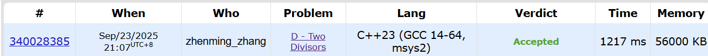


### M02786

```cpp
#include <iostream>
using namespace std;

const int MOD = 32767;

int main()
{
    int n;
    cin >> n;
    while (n--)
    {
        int k;
        cin >> k;
        if (k == 1)
        {
            cout << 1 << endl;
        }
        else if (k == 2)
        {
            cout << 2 << endl;
        }
        else
        {
            int a = 1, b = 2, res;
            for (int i = 3; i <= k; ++i)
            {
                res = (2 * b + a) % MOD;
                a = b;
                b = res;
            }
            cout << b << endl;
        }
    }
    return 0;
}
```

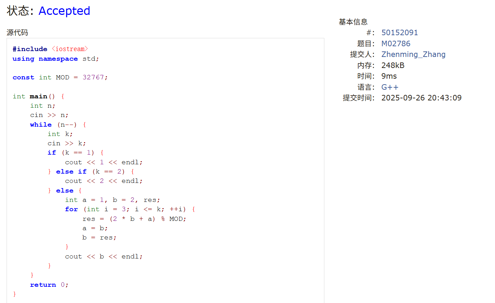

### E23564

```cpp
#include <iostream>
#include <cmath>
#include <vector>
using namespace std;

int main()
{
    int n;
    cin >> n;
    if (n <= 1)
    {
        cout << (n == 1 ? 1 : 0) << endl;
        return 0;
    }
    vector<bool> prime(n + 1, false);
    for (int i = 2; i * i <= n; i++)
    {
        if (!prime[i])
        {
            for (int j = i * i; j <= n; j += i)
            {
                prime[j] = true;
            }
        }
    }
    int tmp = n;
    int cnt_prime = 0;
    for (int i = 2; i <= n && tmp != 1; i++)
    {
        if (!prime[i] && tmp % i == 0)
        {
            int square = 0;
            while (tmp % i == 0)
            {
                tmp /= i;
                cnt_prime++;
                square++;
                if (square == 2)
                {
                    cout << 0 << endl;
                    return 0;
                }
            }
        }
    }
    if (cnt_prime % 2 == 0)
        cout << 1 << endl;
    else
        cout << -1 << endl;

    return 0;
}
```

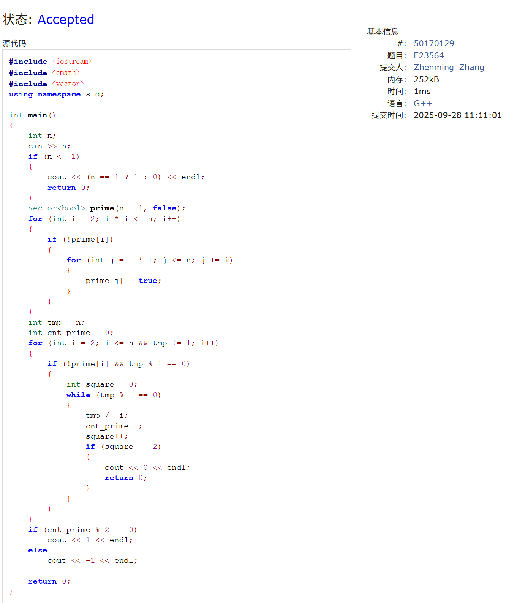

### 3487

```cpp
class Solution {
public:
    int maxSum(vector<int>& nums)
    {
        set<int> n;
        for (int i = 0; i < nums.size(); i++)
            n.insert(nums[i]);
        auto i = n.rbegin();
        int sum = *i;
        i++;
        for (; i != n.rend(); i++)
        {
            if (sum >= sum + *i)
                break;
            sum += *i;
        }
        return sum;
    }
};
```


### M19963
```cpp
#include <iostream>
#include <algorithm>
#include <vector>
using namespace std;

int main()
{
    int n;
    scanf("%d", &n);
    
    vector<int> distance(n);
    vector<vector<double>> ratio_price(n, vector<double>(2));
    vector<double> ratio(n), price(n);
    
    for (int i = 0; i < n; i++)
    {
        int a, b;
        char str[256]; 
        scanf("%s", str); 
        sscanf(str, "(%d,%d)", &a, &b);
        distance[i] = a + b;
    }
    
    for (int i = 0; i < n; i++)
    {
        double a;
        scanf("%lf", &a);
        price[i] = a;
        ratio[i] = distance[i] / a;
        ratio_price[i][0] = distance[i] / a;
        ratio_price[i][1] = a;
    }

    sort(ratio.begin(), ratio.end());
    sort(price.begin(), price.end());
    
    double mid_ratio, mid_price;
    int ans = 0;
    
    if (n % 2 == 1)
    {
        mid_ratio = ratio[n / 2];
        mid_price = price[n / 2];
        for (int i = 0; i < n; i++)
            if (ratio_price[i][0] > mid_ratio && ratio_price[i][1] < mid_price)
                ans++;
    }
    else
    {
        mid_ratio = (ratio[n / 2] + ratio[n / 2 - 1]) / 2;
        mid_price = (price[n / 2] + price[n / 2 - 1]) / 2;
        for (int i = 0; i < n; i++)
            if (ratio_price[i][0] > mid_ratio && ratio_price[i][1] < mid_price)
                ans++;
    }
    
    cout << ans << endl;
    return 0;
}
```

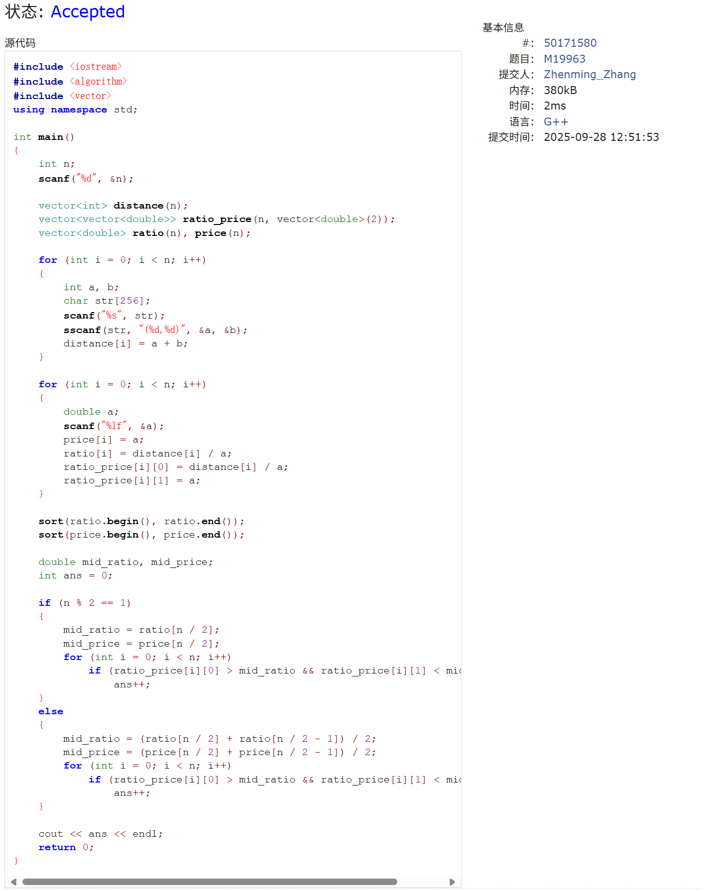

### 1221A
```cpp
#include <iostream>
using namespace std;

int main()
{
    int q;
    cin >> q;
    while (q--)
    {
        int n;
        int dic[2049] = {0};
        cin >> n;
        while (n--)
        {
            int s;
            cin >> s;
            if (s <= 2048)
                dic[s]++;
        }
        for (int i = 1; i < 2048; i *= 2)
            if(dic[i] >= 2)
            {
                dic[i * 2] += dic[i] / 2;
                dic[i] %= 2;
            }
        if (dic[2048] > 0)
            cout << "YES" << endl;
        else
            cout << "NO" << endl;
    }
    return 0;
}

```

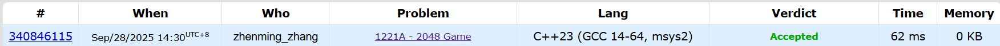

### 456A
```cpp
#include <iostream>
#include <algorithm>
using namespace std;

struct Node
{
    int a;
    int b;
};

bool cmp(Node a, Node b)
{
    return a.a < b.a;
}

int main()
{
    int n;
    cin >> n;
    Node node[n];
    for (int i = 0; i < n; i++)
        cin >> node[i].a >> node[i].b;
    sort(node, node + n, cmp);
    for (int i = 0; i < n - 1; i++)
        if (node[i].b > node[i + 1].b)
        {
            cout << "Happy Alex" << endl;
            return 0;
        }
    cout << "Poor Alex" << endl;
    return 0;
}
```

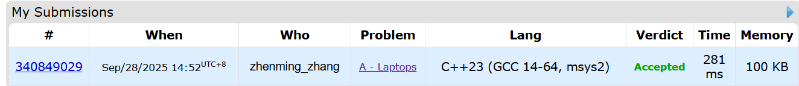

### 230B

```cpp
#include <iostream>
#include <vector>
#include <cmath>
using namespace std;

int main()
{
    int n;
    cin >> n;

    bool vis[1000001] = {false};
    for (int i = 2; i <= 1000; i++)
        if (!vis[i])
            for (int j = i * i; j <= 1000000; j += i)
                vis[j] = true;

    while (n--)
    {
        long long x;
        cin >> x;
        long long s = sqrt(x);
        if (x == s * s && !vis[s] && s > 1)
            cout << "YES" << endl;
        else
            cout << "NO" << endl;
    }

    return 0;
}
```

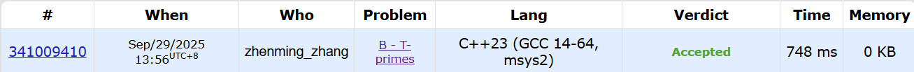