# Assignment #4: T-primes + 贪心

Updated 1814 GMT+8 Sep 30, 2025

2025 fall, Complied by <mark>同学的姓名、院系</mark>


>**说明：**
>
>1. **解题与记录：**
>
>  对于每一个题目，请提供其解题思路（可选），并附上使用Python或C++编写的源代码（确保已在OpenJudge， Codeforces，LeetCode等平台上获得Accepted）。请将这些信息连同显示“Accepted”的截图一起填写到下方的作业模板中。（推荐使用Typora https://typoraio.cn 进行编辑，当然你也可以选择Word。）无论题目是否已通过，请标明每个题目大致花费的时间。
>
>2. 提交安排：**提交时，请首先上传PDF格式的文件，并将.md或.doc格式的文件作为附件上传至右侧的“作业评论”区。确保你的Canvas账户有一个清晰可见的本人头像，提交的文件为PDF格式，并且“作业评论”区包含上传的.md或.doc附件。
> 
>4. **延迟提交：**如果你预计无法在截止日期前提交作业，请提前告知具体原因。这有助于我们了解情况并可能为你提供适当的延期或其他帮助。  
>
>请按照上述指导认真准备和提交作业，以保证顺利完成课程要求。


## 1. 题目

### 34B. Sale

greedy, sorting, 900, https://codeforces.com/problemset/problem/34/B


思路：


代码

```cpp
#include <iostream>
#include <algorithm>
using namespace std;

int main()
{
    int n, m;
    cin >> n >> m;
    int a[101];
    for (int i = 0; i < n; i++)
        cin >> a[i];
    sort(a, a + n);
    int sum = 0;
    for (int i = 0; i < m; i++)
    {
        if (a[i] >= 0)
            break;
        sum -= a[i];
    }
    cout << sum << endl;
    return 0;
}
```


代码运行截图 <mark>（至少包含有"Accepted"）</mark>

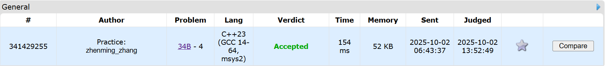


### 160A. Twins

greedy, sortings, 900, https://codeforces.com/problemset/problem/160/A


思路：


代码

```cpp
#include <iostream>
#include <algorithm>
using namespace std;

bool cmp(int a, int b)
{
    return a > b;
}

int main()
{
    int n;
    int sum = 0, sum1 = 0, sum2 = 0;
    int a[101];
    cin >> n;
    for (int i = 0; i < n; i++)
    {
        cin >> a[i];
        sum += a[i];
    }
    sort(a, a + n, cmp);
    for (int i = 0; i < n; i++)
    {
        sum1 += a[i];
        sum2 = sum - sum1;
        if (sum1 > sum2)
        {
            cout << i + 1 << endl;
            return 0;
        }
    }
}
```
>共用时3min


代码运行截图 <mark>（至少包含有"Accepted"）</mark>
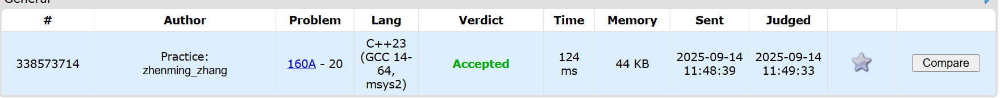


### 1879B. Chips on the Board

constructive algorithms, greedy, 900, https://codeforces.com/problemset/problem/1879/B


思路：


代码

```cpp
#include <iostream>
#include <cmath>
using namespace std;
 
int main()
{
    int t;
    cin >> t;
    while (t--)
    {
        long long n;
        cin >> n;
        int a, b;
        long long aMin = 2000000000, bMin = 2000000000;
        long long sum1 = 0, sum2 = 0;
        for (int j = 0; j < n; j++)
        {
            cin >> a;
            sum1 += a;
            aMin = aMin < a ? aMin : a;
        }
        for (int j = 0; j < n; j++)
        {
            cin >> b;
            sum2 += b;
            bMin = bMin < b ? bMin : b;
        }
        long long ans = sum1 + n * bMin < sum2 + n * aMin ? sum1 + n * bMin : sum2 + n * aMin;
        cout << ans << endl;
    }
    return 0;
}
```

>共用时10min

代码运行截图 <mark>（至少包含有"Accepted"）</mark>
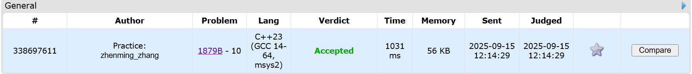


### M01017: 装箱问题

greedy, http://cs101.openjudge.cn/pctbook/M01017/


思路：贪心，思路很简单，但代码实现有点麻烦


代码

```cpp
#include <iostream>
using namespace std;

int main()
{
    int a[7];
    while (true)
    {
        int sum = 0;
        for (int i = 0; i < 6; i++)
            cin >> a[i];
        if (a[0] == 0 && a[1] == 0 && a[2] == 0 && a[3] == 0 && a[4] == 0 && a[5] == 0)
            break;

        sum += a[5];

        sum += a[4];
        a[0] -= a[4] * 11;
        if (a[0] < 0)
            a[0] = 0;

        sum += a[3];
        a[1] -= a[3] * 5;
        if (a[1] < 0)
        {
            a[0] += a[1] * 4;
            a[1] = 0;
        }
        if (a[0] < 0)
            a[0] = 0;

        sum += a[2] / 4;
        if (a[2] % 4 > 0)
        {
            sum++;
            int left2[4] = {0, 5, 3, 1};
            int left1[4] = {0, 7, 6, 5};
            int need2 = left2[a[2] % 4];
            int need1 = left1[a[2] % 4];
            if (a[1] > need2)
            {
                a[1] -= need2;
            }
            else
            {
                need1 += (need2 - a[1]) * 4;
                a[1] = 0;
            }
            a[0] -= need1;
            if (a[0] < 0)
                a[0] = 0;
        }

        sum += a[1] / 9;
        if (a[1] % 9 > 0)
        {
            sum++;
            a[0] -= 36 - a[1] % 9 * 4;
            if (a[0] < 0)
                a[0] = 0;
        }

        sum += a[0] / 36;
        if (a[0] % 36 > 0)
            sum++;
        cout << sum << endl;
    }
    return 0;
}
```

>共用时30min

代码运行截图 <mark>（至少包含有"Accepted"）</mark>

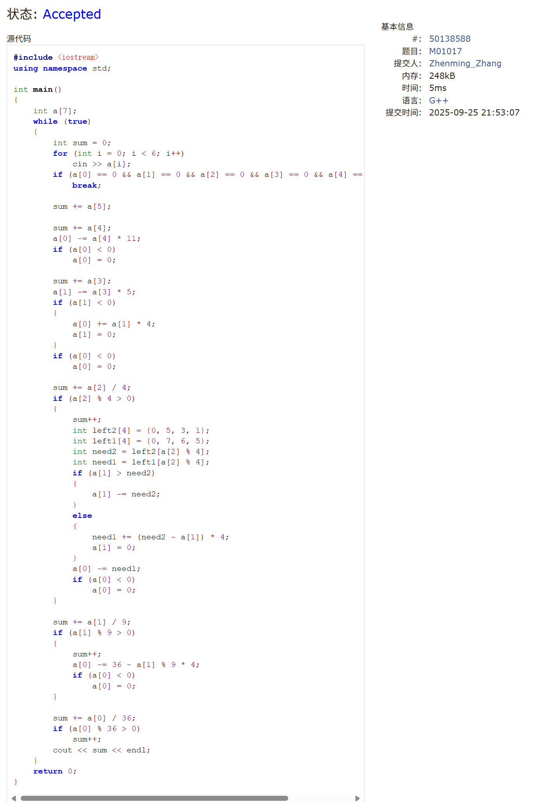


### M01008: Maya Calendar

implementation, http://cs101.openjudge.cn/practice/01008/


思路：日期计算很简单，但是有个tricky的地方就是如果days中日期+1那么对于被260整除的数会计算成下一年。


代码

```cpp
#include <iostream>
#include <algorithm>
#include <vector>
using namespace std;

int main()
{
    int n;
    cin >> n;
    vector<string> Habb = {"pop", "no", "zip", "zotz", "tzec", "xul", "yoxkin", "mol", "chen", "yax", "zac", "ceh", "mac", "kankin", "muan", "pax", "koyab", "cumhu", "uayet"};
    string Tzolkin[] = {"ahau", "imix", "ik", "akbal", "kan", "chicchan", "cimi", "manik", "lamat", "muluk", "ok", "chuen", "eb", "ben", "ix", "mem", "cib", "caban", "eznab", "canac"};
    cout << n << endl;
    for (int i = 0; i < n; i++)
    {
        int H_Year, H_Date;
        string H_Month;
        cin >> H_Date;
        cin.ignore();
        cin >> H_Month >> H_Year;
        int days;
        for (int i = 0; i < Habb.size(); i++)
            if (Habb[i] == H_Month)
            {
                days = i * 20;
                break;
            }
        days += H_Date + H_Year * 365;
        int T_Year = days / 260;
        string T_Month = Tzolkin[(days + 1) % 260 % 20];
        int T_Date = days % 260 % 13 + 1;
        cout << T_Date << ' ' << T_Month << ' ' << T_Year << endl;
    }
    return 0;
}
```
>共用时50min


代码运行截图 <mark>（至少包含有"Accepted"）</mark>

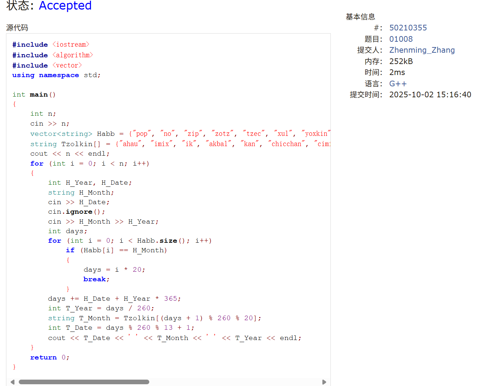


### 230B. T-primes（选做）

binary search, implementation, math, number theory, 1300, http://codeforces.com/problemset/problem/230/B


思路：感觉比Maya简单（，因为可以直接用sqrt计算，用了scanf和printf加快输入输出（用时可以直接腰斩）


代码

```cpp
#include <iostream>
#include <vector>
#include <cmath>
using namespace std;

int main()
{
    int n;
    scanf("%d", &n);

    bool vis[1000001] = {false};
    for (int i = 2; i <= 1000; i++)
        if (!vis[i])
            for (int j = i * i; j <= 1000000; j += i)
                vis[j] = true;

    while (n--)
    {
        long long x;
        scanf("%I64d", &x);
        long long s = sqrt(x);
        if (x == s * s && !vis[s] && s > 1)
            printf("YES\n");
        else
            printf("NO\n");
    }

    return 0;
}
```
>共用时30min


代码运行截图 <mark>（至少包含有"Accepted"）</mark>
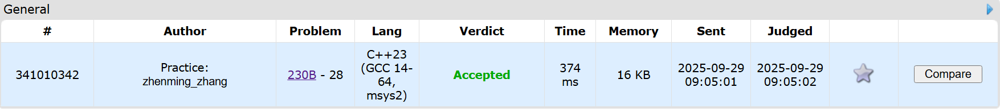


## 2. 学习总结和收获

<mark>如果作业题目简单，有否额外练习题目，比如：OJ“计概2025fall每日选做”、CF、LeetCode、洛谷等网站题目。</mark>

学习了dp和双指针，联系了一下基础题

### 339B
```cpp
#include <iostream>
using namespace std;

int main()
{
    int n, m;
    scanf("%d%d", &n, &m);
    int curr = 1;
    long long step = 0;
    for (int i = 0; i < m; i++)
    {
        int a;
        scanf("%d", &a);
        if (curr <= a)
            step += a - curr;
        else
            step += n - curr + a;
        curr = a;
    }
    printf("%I64d\n", step);
    return 0;
}
```

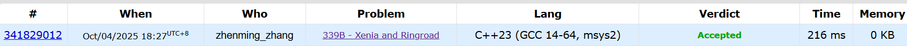


### E23563

判了一下a=1的情况，应该可以用了

```cpp
#include <iostream>
using namespace std;

int main()
{
    string str;
    int i = 0;
    int a = 1, b = 0;
    int ans = 0;
    while (getline(cin, str, '+'))
    {
        auto c_str = str.data();
        if (str[0] == 'n')
            b = stoi(str.substr(2));
        else
            sscanf(c_str, "%dn^%d", &a, &b);
        if (a >= 1)
            ans = ans > b ? ans : b;
    }
    printf("n^%d\n", ans);
    return 0;
}
```
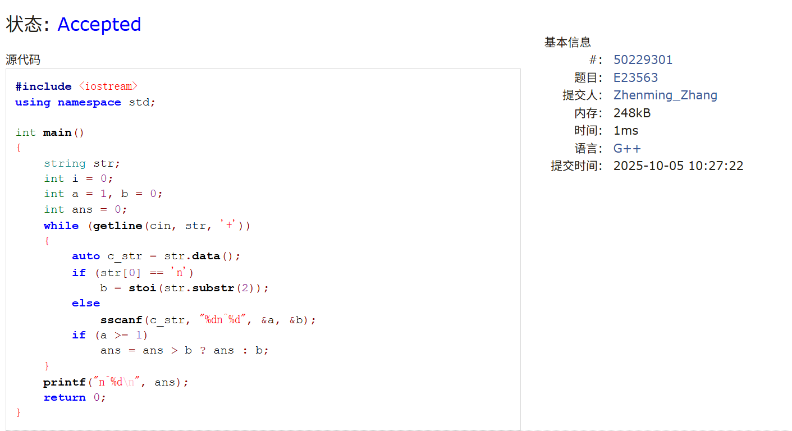

### 20B
```cpp
#include <iostream>
#include <cmath>
using namespace std;

int main()
{
    double a, b, c;
    scanf("%lf%lf%lf", &a, &b, &c);
    if (a == 0)
    {
        if (b == 0)
            if (c == 0)
                printf("-1\n");
            else 
                printf("0\n");
        else
            printf("1\n%lf\n", -c / b);
        return 0;
    }
    double delta = b * b - 4 * a * c;
    if (delta < 0)
        printf("0\n");
    else if (delta == 0)
        printf("1\n%lf\n", -b / (2 * a));
    else if (a > 0)
        printf("2\n%lf\n%lf\n", (-b - sqrt(delta)) / (2 * a), (-b + sqrt(delta)) / (2 * a));
    else
        printf("2\n%lf\n%lf\n", (-b + sqrt(delta)) / (2 * a), (-b - sqrt(delta)) / (2 * a));
    return 0;
}
```

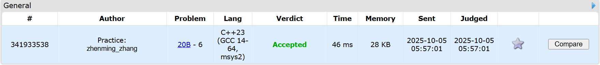

### 02783
```cpp
#include <iostream>
#include <algorithm>
using namespace std;

struct Node
{
    int d, c;
};

bool cmp(Node a, Node b)
{
    if (a.c != b.c)
        return a.c < b.c;
    return a.d < b.d;
}

int main()
{
    int n;
    while (scanf("%d", &n) && n)
    {
        Node hotel[10001];
        for (int i = 0; i < n; i++)
            scanf("%d%d", &hotel[i].d, &hotel[i].c);
        sort(hotel, hotel + n, cmp);

        int ans = 0;
        int min_d = 1e9 + 1;
        for (int i = 0; i < n; i++)
            if (hotel[i].d < min_d)
            {
                ans++;
                min_d = hotel[i].d;
            }
        printf("%d\n", ans);
    }
    return 0;
}
```

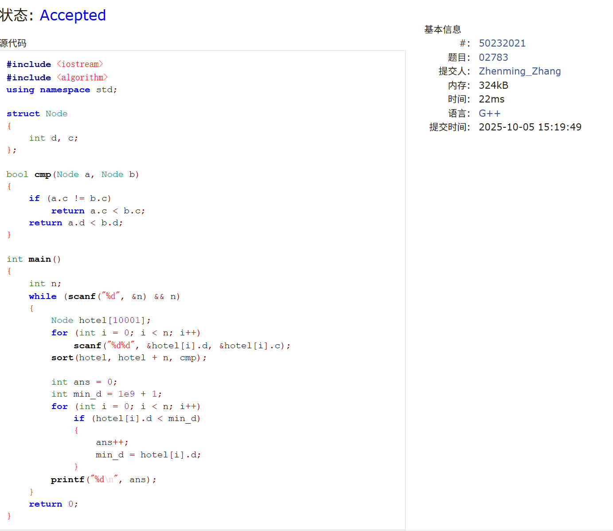

### 313B
```cpp
#include <iostream>
#include <string>
#include <vector>
using namespace std;

int main()
{
    string str;
    cin >> str;
    int n;
    cin >> n;
    vector<int> pre(str.length(), 0);
    for (int i = 1; i < str.length(); i++)
        pre[i] = pre[i - 1] + (str[i] == str[i - 1] ? 1 : 0);
    while (n--)
    {
        int l, r;
        cin >> l >> r;
        cout << pre[r - 1] - pre[l - 1] << endl;
    }
    return 0;
}
```

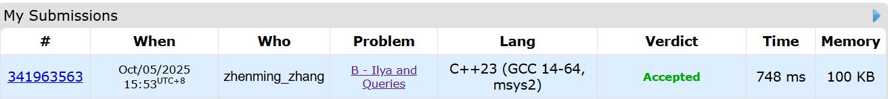

### E02753
```cpp
//dp
#include <iostream>
using namespace std;

int main()
{
    int n;
    cin >> n;
    for (int i = 0; i < n; i++)
    {
        int input;
        cin >> input;
        if (input == 1 || input == 2)
        {
            cout << 1 << endl;
            continue;
        }
        int a = 1, b = 1;
        int tmp;
        for (int i = 0; i < input - 2; i++)
        {
            tmp = a + b;
            a = b;
            b = tmp;
        }
        cout << b << endl;
    }
    return 0;
}

//math
#include <iostream>
#include <cmath>
using namespace std;

int main()
{
    int n;
    cin >> n;
    for (int i = 0; i < n; i++)
    {
        int input;
        cin >> input;
        cout << (1 / sqrt(5)) * (pow((1 + sqrt(5)) / 2, input) - pow((1 - sqrt(5)) / 2, input)) << endl;
    }
    return 0;
}
```

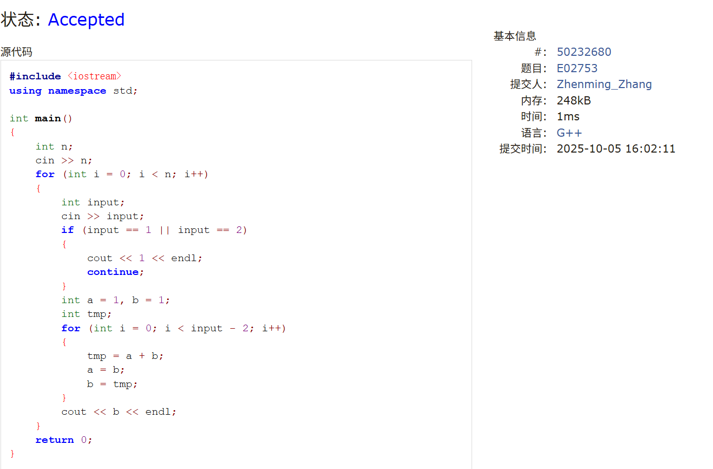

### 508A

```cpp
#include <iostream>
#include <vector>
using namespace std;

int main()
{
    int n, m, k;
    scanf("%d%d%d", &n, &m, &k);
    bool matrix[1002][1002] = {0};
    for (int i = 0; i < k; i++)
    {
        int x, y;
        scanf("%d%d", &x, &y);
        matrix[x][y] = true;
        if ((matrix[x + 1][y] && matrix[x + 1][y + 1] && matrix[x][y + 1]) || (matrix[x + 1][y] && matrix[x + 1][y - 1] && matrix[x][y - 1]) || (matrix[x][y + 1] && matrix[x - 1][y + 1] && matrix[x - 1][y]) || (matrix[x][y - 1] && matrix[x - 1][y - 1] && matrix[x - 1][y]))
        {
            cout << i + 1 << endl;
            return 0;
        }
    }
    cout << 0 << endl;
    return 0;
}
```

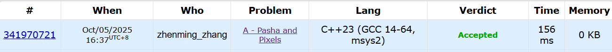

### E19942
```cpp
#include <cstdio>
#include <vector>
using namespace std;

int main()
{
    int m, n, p, q;
    scanf("%d%d%d%d", &m, &n, &p, &q);
    vector<vector<int>> matrix(m, vector<int>(n));
    vector<vector<int>> kernel(p, vector<int>(q));
    for (int i = 0; i < m; i++)
        for (int j = 0; j < n; j++)
            scanf("%d", &matrix[i][j]);
    for (int i = 0; i < p; i++)
        for (int j = 0; j < q; j++)
            scanf("%d", &kernel[i][j]);

    int row_limit = m + 1 - p;
    int col_limit = n + 1 - q;
    for (int i = 0; i < row_limit; i++)
    {
        for (int j = 0; j < col_limit; j++)
        {
            int sum = 0;
            for (int k = 0; k < p; k++)
                for (int l = 0; l < q; l++)
                    sum += matrix[i + k][j + l] * kernel[k][l];
            printf("%d%c", sum, (j == col_limit - 1) ? '\n' : ' ');
        }
    }
    return 0;
}
```

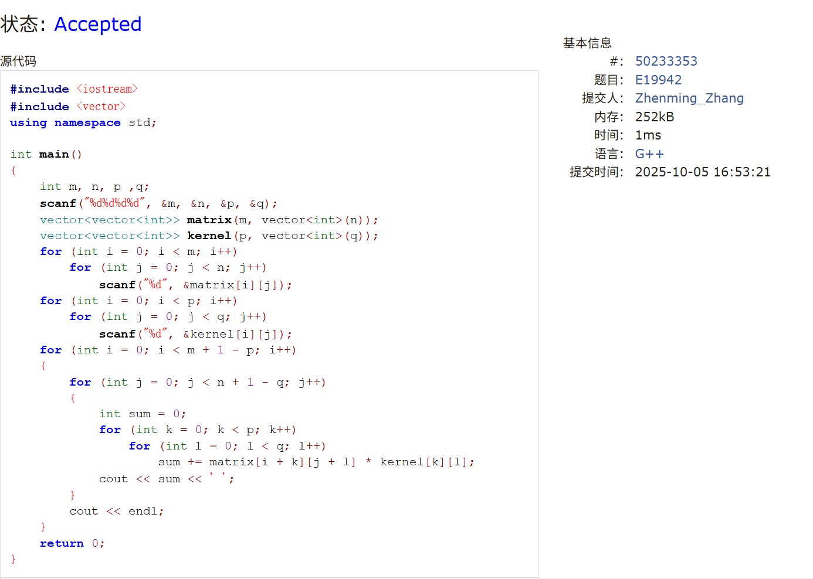