# Assignment #5: 20251009 cs101 Mock Exam寒露第二天

Updated 1651 GMT+8 Oct 9, 2025

2025 fall, Complied by <mark>同学的姓名、院系</mark>


>**说明：**
>
>1. **解题与记录：**
>
>  对于每一个题目，请提供其解题思路（可选），并附上使用Python或C++编写的源代码（确保已在OpenJudge， Codeforces，LeetCode等平台上获得Accepted）。请将这些信息连同显示“Accepted”的截图一起填写到下方的作业模板中。（推荐使用Typora https://typoraio.cn 进行编辑，当然你也可以选择Word。）无论题目是否已通过，请标明每个题目大致花费的时间。
>
>2. 提交安排：**提交时，请首先上传PDF格式的文件，并将.md或.doc格式的文件作为附件上传至右侧的“作业评论”区。确保你的Canvas账户有一个清晰可见的本人头像，提交的文件为PDF格式，并且“作业评论”区包含上传的.md或.doc附件。
> 
>4. **延迟提交：**如果你预计无法在截止日期前提交作业，请提前告知具体原因。这有助于我们了解情况并可能为你提供适当的延期或其他帮助。  
>
>请按照上述指导认真准备和提交作业，以保证顺利完成课程要求。


## 1. 题目

### E29895: 分解因数

implementation, http://cs101.openjudge.cn/practice/29895/


思路：int会爆数据:(


代码

```cpp
#include <iostream>
using namespace std;

int main()
{
    long long n;
    cin >> n;
    for (long long i = 2; i * i <= n; i++)
    {
        if (n % i == 0)
        {
            cout << n / i << endl;
            return 0;
        }
    }
    cout << 1 << endl;
    return 0;
}

```


代码运行截图 <mark>（至少包含有"Accepted"）</mark>

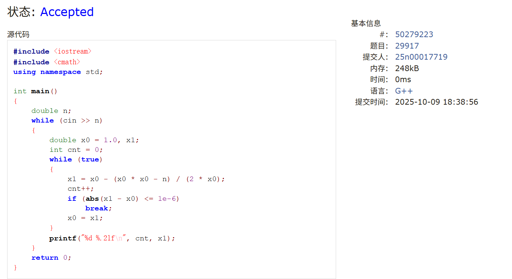

### E29940: 机器猫斗恶龙

greedy, http://cs101.openjudge.cn/practice/29940/


思路：


代码

```cpp
#include <iostream>
#include <vector>
using namespace std;

int main()
{
	int n;
	cin >> n;
	int sum = 0;
	int min = 1e9 + 1;
	for (int i = 0; i < n; i++)
	{
		int a;
		cin >> a;
		sum += a;
		min = min < sum ? min : sum;
	}
	if (min > 0)
		cout << 0 << endl;
	else
	cout << -min + 1 << endl;
	return 0;
}
```


代码运行截图 <mark>（至少包含有"Accepted"）</mark>

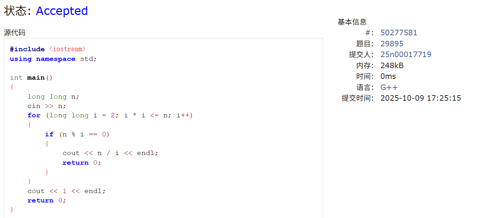


### M29917: 牛顿迭代法

implementation, http://cs101.openjudge.cn/practice/29917/


思路：


代码

```cpp
#include <iostream>
#include <cmath>
using namespace std;

int main()
{
    double n;
    while (cin >> n)
    {
        double x0 = 1.0, x1;
        int cnt = 0;
        while (true)
        {
            x1 = x0 - (x0 * x0 - n) / (2 * x0);
            cnt++;
            if (abs(x1 - x0) <= 1e-6)
                break;
            x0 = x1;
        }
        printf("%d %.2lf\n", cnt, x1);
    }
    return 0;
}
```


代码运行截图 <mark>（至少包含有"Accepted"）</mark>


### M29949: 贪婪的哥布林

greedy, http://cs101.openjudge.cn/practice/29949/


思路：


代码

```cpp
#include <iostream>
#include <algorithm>
#include <vector>
#include <cmath>
using namespace std;

struct Node
{
	double v, w;
	double vpw;
}mine[101];

bool cmp(Node a, Node b)
{
	return a.vpw > b.vpw;
}

int main()
{
	int n, m;
	cin >> n >> m;
	for (int i = 0; i < n; i++)
	{
		cin >> mine[i].v >> mine[i].w;
		mine[i].vpw = mine[i].v / mine[i].w;
	}
	sort(mine, mine + n, cmp);
	int i = 0;
	double sum = 0;
	while (m > 0 && i < n)
	{
		if (mine[i].w <= m)
		{
			m -= mine[i].w;
			sum += mine[i].v;
		}
		else
		{
			sum += mine[i].vpw * m;
			m = 0;
		}
		i++;
	}
	printf("%.2lf\n", sum);
	return 0;
}

```


代码运行截图 <mark>（至少包含有"Accepted"）</mark>

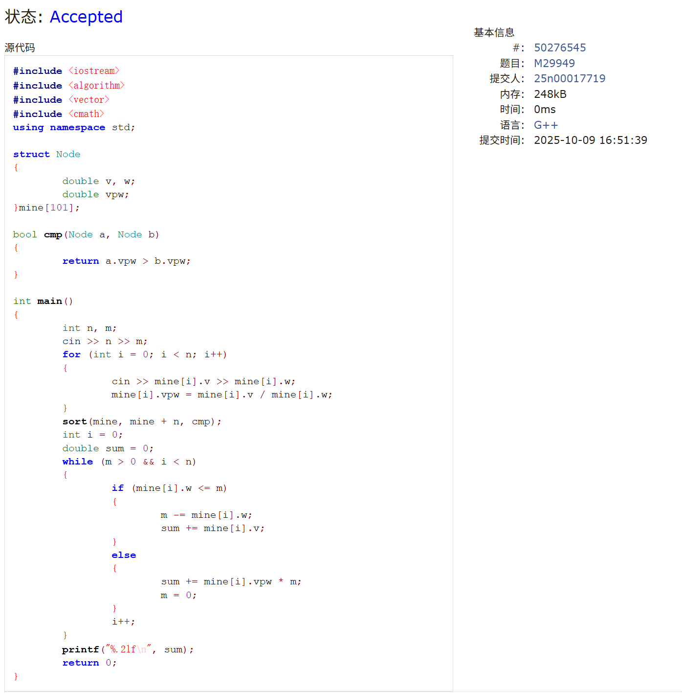


### M29918: 求亲和数

implementation, http://cs101.openjudge.cn/practice/29918/


思路：


代码

```cpp
#include <iostream>
using namespace std;

int main()
{
	int n;
	cin >> n;
	bool x[1000000] = { 0 };
	for (int j = 220; j <= n; j++)
	{
		int a = 1, b = 1;
		for (int i = 2; i * i < j; i++)
			if (j % i == 0)
				a += i + j / i;
		for (int i = 2; i * i < a; i++)
			if (a % i == 0)
				b += i + a / i;
		if (b == j && a <= n && a != b && x[a] == 0 && x[b] == 0)
		{
			a > b ? cout << b << ' ' << a << endl : cout << a << ' ' << b << endl;
			x[a] = 1, x[b] = 1;
		}
	}
	return 0;
}
```
>考试的时候写的，非常丑陋
```cpp
#include <iostream>
#include <vector>
using namespace std;

int main()
{
    int n;
    cin >> n;
    vector<int> sum(n + 1, 0);
    for (int i = 1; i <= n / 2; i++)
        for (int j = i * 2; j <= n; j += i)
            sum[j] += i;
    for (int i = 2; i <= n; i++)
    {
        int tmp = sum[i];
        if (tmp > i && tmp <= n && sum[tmp] == i)
            cout << i << ' ' << tmp << endl;
    }
    return 0;
}
```
>优化了一下，用了预处理，美丽多了

代码运行截图 <mark>（至少包含有"Accepted"）</mark>

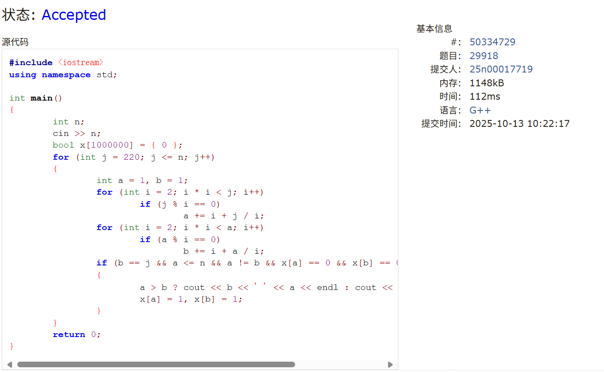


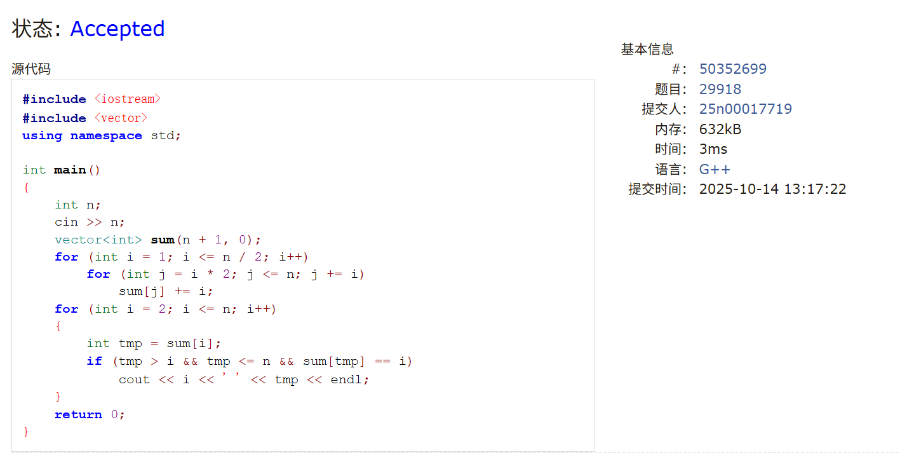


### T29947:校门外的树又来了（选做）

http://cs101.openjudge.cn/practice/29947/


思路：和栈等价的代码


代码

```cpp
#include <iostream>
#include <algorithm>
using namespace std;

struct Node
{
    int l, r;
} metro[101];

bool cmp(Node a, Node b)
{
    return a.l < b.l;
}

int main()
{
    int l, m;
    cin >> l >> m;
    for (int i = 0; i < m; i++)
        cin >> metro[i].l >> metro[i].r;
    sort(metro, metro + m, cmp);
    int itl = metro[0].l, itr = metro[0].r;
    for (int i = 1; i < m; i++)
    {
        if (metro[i].l <= itr + 1)
            itr = itr > metro[i].r ? itr : metro[i].r;
        else
        {
            l -= ((itr - itl) + 1);
            itl = metro[i].l, itr = metro[i].r;
        }
    }
    cout << l + 1 - (itr - itl) - 1 << endl;
    return 0;
}
```


代码运行截图 <mark>（至少包含有"Accepted"）</mark>

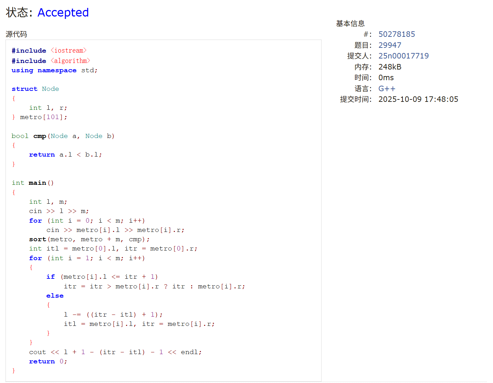


## 2. 学习总结和收获

<mark>如果作业题目简单，有否额外练习题目，比如：OJ“计概2025fall每日选做”、CF、LeetCode、洛谷等网站题目。</mark>

考试并不是很理想，第一题就因为没看数据范围用了int爆掉了（，考试的时候瞪了好久没看出来导致浪费了大量的时间，其实除了牛顿法那题其他都挺简单的（数学不好看不懂牛顿法怎么操作，后面问了ai才知道的），国庆也没有特别刻意的刷题导致手有点生，正在恶补ADS中......

### M02746

```cpp
#include <iostream>
#include <queue>
using namespace std;

int main()
{
    int n, m;
    while(true)
    {
        cin >> n >> m;
        if (n == 0 && m == 0)
            break;
        queue<int> q;
        for (int i = 1; i <= n; i++)
            q.push(i);
        int flag = 1;
        while (q.size() > 1)
        {
            if (flag >= m)
            {
                q.pop();
                flag = 1;
            }
            else
            {
                int tmp = q.front();
                q.pop();
                q.push(tmp);
                flag++;
            }
        }
        cout << q.front() << endl;
    }
    return 0;
}
```

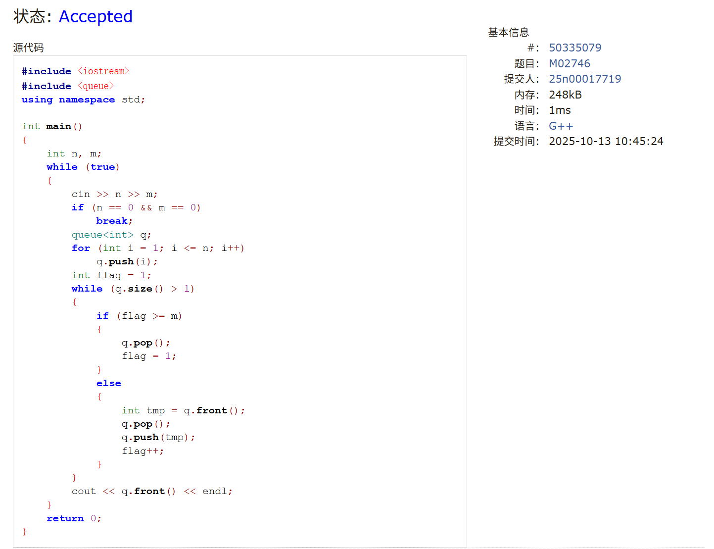

### E23555
```cpp
#include <iostream>
#include <vector>
using namespace std;

int main()
{
    int n;
    scanf("%d", &n);
    vector<vector<int>> x(n, vector<int>(n, 0));
    vector<vector<int>> y(n, vector<int>(n, 0));

    int m1, m2;
    scanf("%d%d", &m1, &m2);
    for (int i = 0; i < m1; i++)
    {
        int a, b, v;
        scanf("%d%d%d", &a, &b, &v);
        x[a][b] = v;
    }
    for (int i = 0; i < m2; i++)
    {
        int a, b, v;
        scanf("%d%d%d", &a, &b, &v);
        y[a][b] = v;
    }
    
    for (int i = 0; i < n; i++)
        for (int j = 0; j < n; j++)
        {
            int ans = 0;
            for (int k = 0; k < n; k++)
                ans += x[i][k] * y[k][j];
            if (ans != 0)
                printf("%d %d %d\n", i, j, ans);
        }
    return 0;
}
```

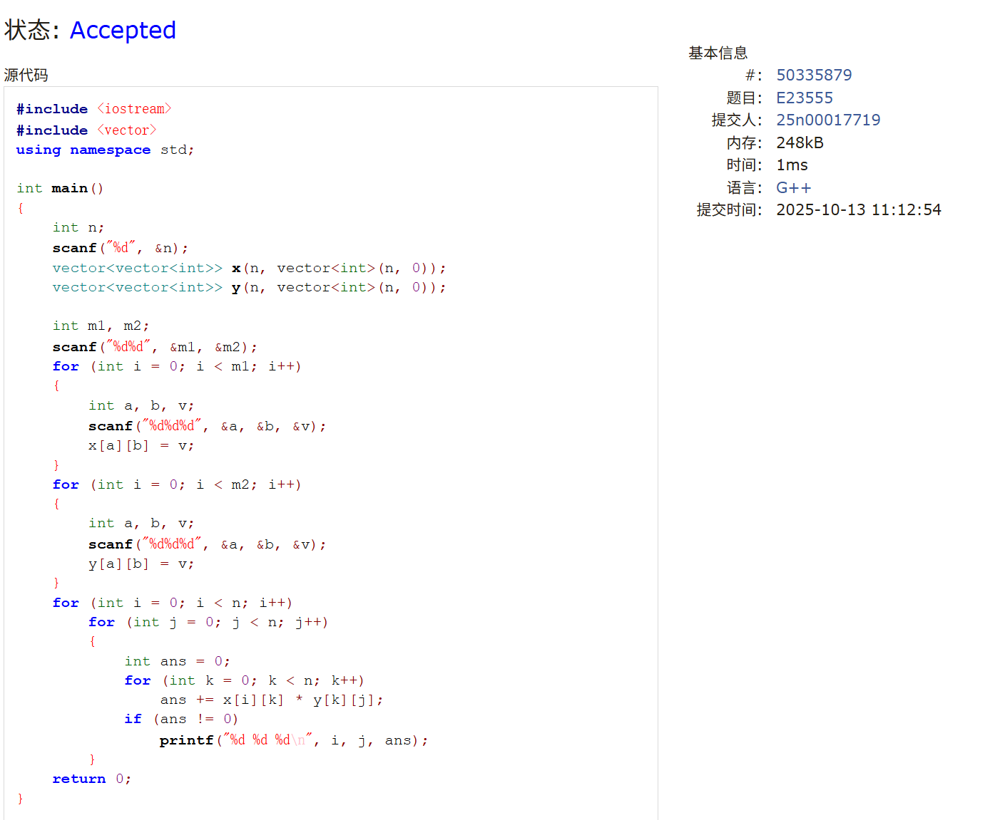

### sy83
```cpp
#include <iostream>
#include <vector>
using namespace std;

int main()
{
    int n;
    cin >> n;
    vector<string> str(n);
    for (int i = 0; i < n; i++)
        cin >> str[i];
    
    int r = str[0].size();
    for (int i = 1; i < n; i++)
    {
        int it = 0;
        for (; it < r; it++)
            if (str[1][it] != str[0][it])
                break;
        r = it;
    }
    
    for (int i = 0; i < r; i++)
        cout << str[0][i];
    cout << endl;
    return 0;
}
```

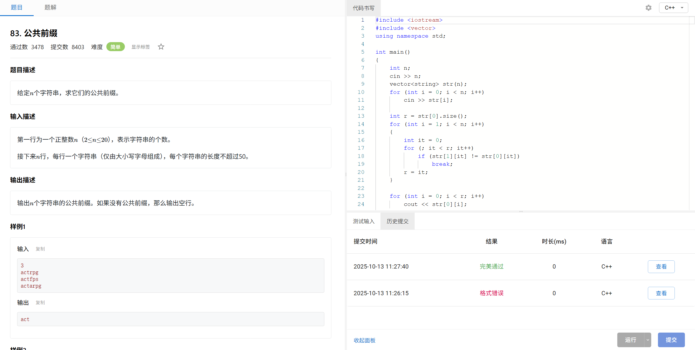


### sy569
```cpp
#include <iostream>
#include <vector>
using namespace std;

int main()
{
    int n, q;
    cin >> n >> q;
    vector<vector<bool>> exist(n + 1, vector<bool>(n + 1, 0));

    while (q--)
    {
        int x, y;
        cin >> x >> y;
        exist[x][y] = 1;
    }

    for (int i = 1; i < n; i++)
        for (int j = i + 1; j <= n; j++)
            if (exist[i][j] == 1 && exist[j][i] == 1)
            {
                cout << "Yes" << endl;
                return 0;
            }
    cout << "No" << endl;
    return 0;
}
```

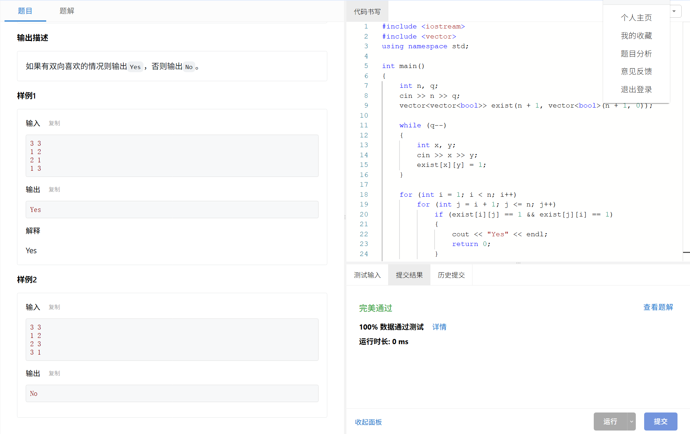

### 1078
```cpp
class Solution {
public:
    vector<string> findOcurrences(string text, string first, string second) {
        vector<string> words;
        int it1 = 0, it2 = 0;
        while (true) {
            while (it1 < text.length() && text[it1] == ' ')
                it1++;
            if (it1 >= text.length())
                break;
            it2 = it1 + 1;
            while (it2 < text.length() && text[it2] != ' ')
                it2++;
            words.push_back(text.substr(it1, it2 - it1));
            it1 = it2 + 1;
        }
        vector<string> ans;
        for (int i = 2; i < words.size(); i++)
            if (words[i - 2] == first && words[i - 1] == second)
                ans.push_back(words[i]);
        return ans;
    }
};
```


### sy570
```cpp
#include <iostream>
#include <vector>
using namespace std;

int main()
{
    int n, q;
    cin >> n >> q;
    vector<vector<bool>> exist(n + 1, vector<bool>(n + 1, 0));

    while (q--)
    {
        int x, y;
        cin >> x >> y;
        exist[x][y] = 1;
    }

    for (int i = 1; i <= n; i++)
        for (int j = 1; j <= n; j++)
            for (int k = 1; k <= n; k++)
                if (exist[i][j] == 1 && exist[j][k] == 1 && exist[k][i] == 1 && i != j && j != k && k != i)
                {
                    cout << "Yes" << endl;
                    return 0;
                }
    cout << "No" << endl;
    return 0;
}
```
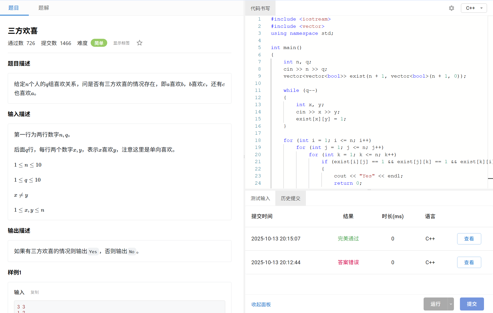


### M06640
已经尽量在优化了......
```cpp
#include <iostream>
#include <vector>
#include <unordered_map>
using namespace std;

int main()
{
    ios::sync_with_stdio(false);
    cin.tie(nullptr);

    int n;
    cin >> n;

    unordered_map<string, vector<int>> mp;
    
    for (int i = 1; i <= n; i++)
    {
        int a;
        cin >> a;
        while (a--)
        {
            string s;
            cin >> s;
            if (mp[s].empty() || mp[s].back() != i)
                mp[s].push_back(i);
        }
    }

    int m;
    cin >> m;
    for (int i = 0; i < m; i++)
    {
        string str;
        cin >> str;
        if (mp[str].empty())
            cout << "NOT FOUND\n";
        else
            for (auto j : mp[str])
                j != mp[str].back() ? cout << j << ' ' : cout << j << endl;
    }

    return 0;
}
```

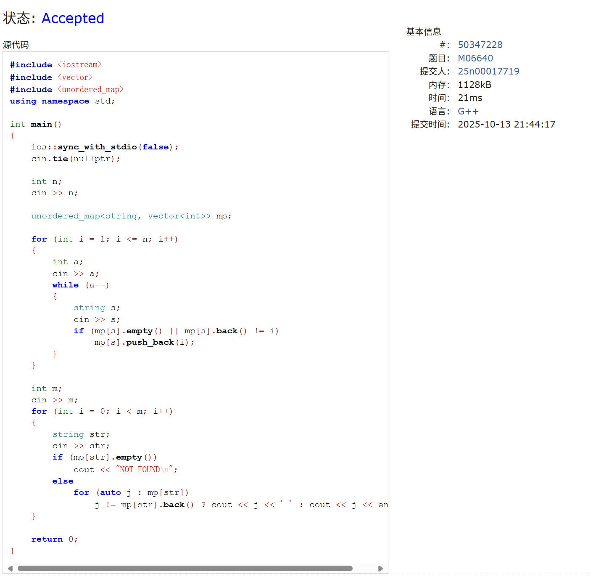