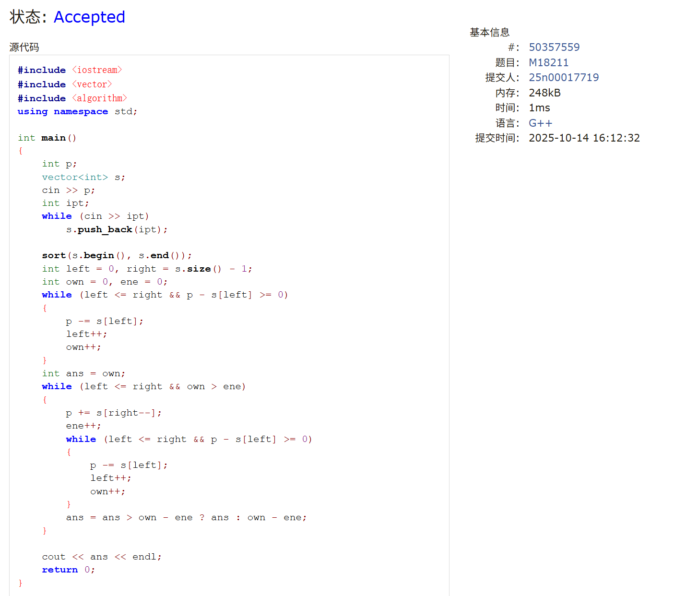
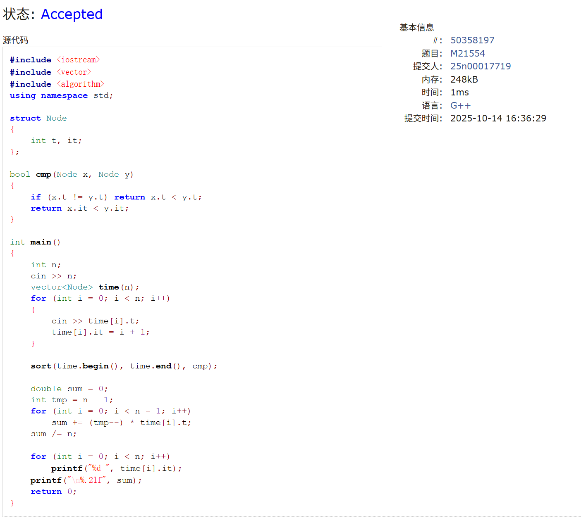
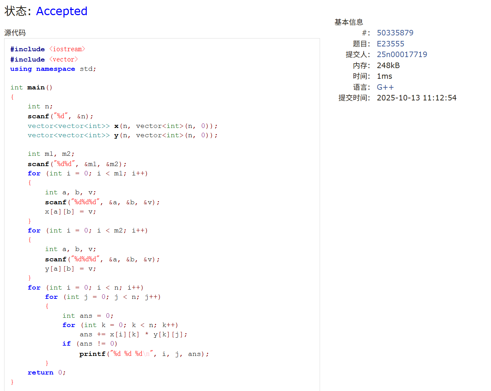
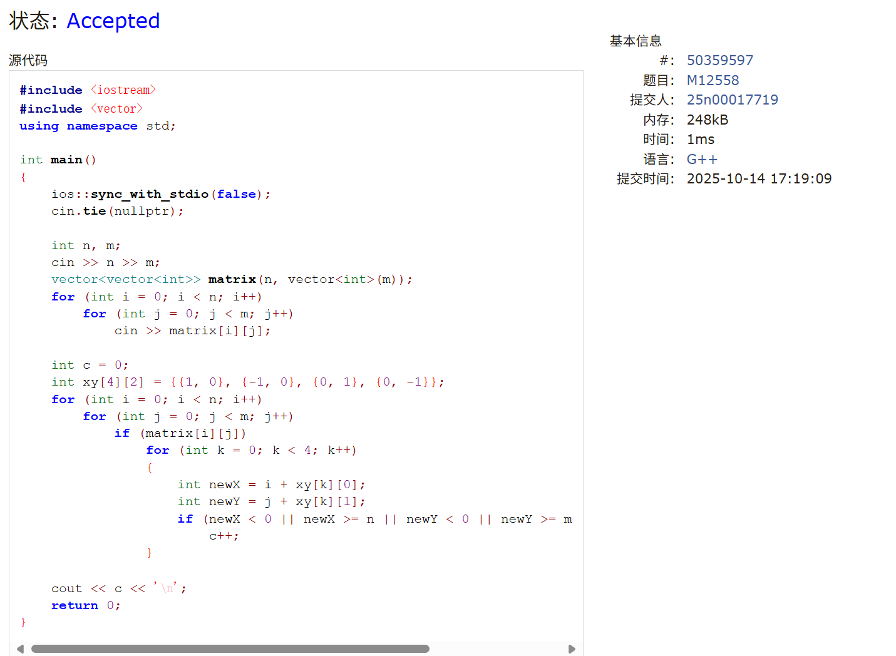
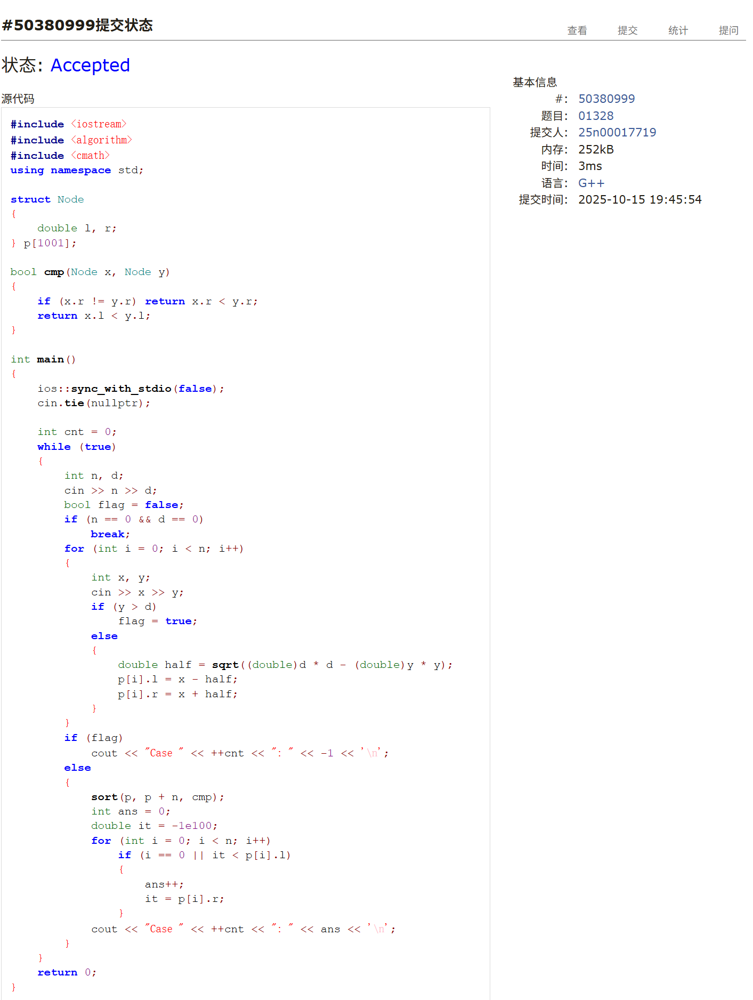
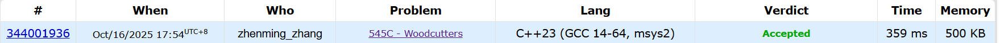

# Assignment #6: 矩阵、贪心

Updated 1432 GMT+8 Oct 14, 2025

2025 fall, Complied by <mark>同学的姓名、院系</mark>


>**说明：**
>
>1. **解题与记录：**
>
>  对于每一个题目，请提供其解题思路（可选），并附上使用Python或C++编写的源代码（确保已在OpenJudge， Codeforces，LeetCode等平台上获得Accepted）。请将这些信息连同显示“Accepted”的截图一起填写到下方的作业模板中。（推荐使用Typora https://typoraio.cn 进行编辑，当然你也可以选择Word。）无论题目是否已通过，请标明每个题目大致花费的时间。
>
>2. 提交安排：**提交时，请首先上传PDF格式的文件，并将.md或.doc格式的文件作为附件上传至右侧的“作业评论”区。确保你的Canvas账户有一个清晰可见的本人头像，提交的文件为PDF格式，并且“作业评论”区包含上传的.md或.doc附件。
> 
>4. **延迟提交：**如果你预计无法在截止日期前提交作业，请提前告知具体原因。这有助于我们了解情况并可能为你提供适当的延期或其他帮助。  
>
>请按照上述指导认真准备和提交作业，以保证顺利完成课程要求。


## 1. 题目

### M18211: 军备竞赛

greedy, two pointers, http://cs101.openjudge.cn/pctbook/M18211


思路：


代码

```cpp
#include <iostream>
#include <vector>
#include <algorithm>
using namespace std;

int main()
{
    int p;
    vector<int> s;
    cin >> p;
    int ipt;
    while (cin >> ipt)
        s.push_back(ipt);

    sort(s.begin(), s.end());
    int left = 0, right = s.size() - 1;
    int own = 0, ene = 0;
    while (left <= right && p - s[left] >= 0)
    {
        p -= s[left];
        left++;
        own++;
    }
    int ans = own;
    while (left <= right && own > ene)
    {
        p += s[right--];
        ene++;
        while (left <= right && p - s[left] >= 0)
        {
            p -= s[left];
            left++;
            own++;
        }
        ans = ans > own - ene ? ans : own - ene;
    }

    cout << ans << endl;
    return 0;
}

```

>共用时30min

代码运行截图 <mark>（至少包含有"Accepted"）</mark>



### M21554: 排队做实验

greedy, http://cs101.openjudge.cn/pctbook/M21554/


思路：


代码

```cpp
#include <iostream>
#include <vector>
#include <algorithm>
using namespace std;

struct Node
{
    int t, it;
};

bool cmp(Node x, Node y)
{
    if (x.t != y.t) return x.t < y.t;
    return x.it < y.it;
}

int main()
{
    int n;
    cin >> n;
    vector<Node> time(n);
    for (int i = 0; i < n; i++)
    {
        cin >> time[i].t;
        time[i].it = i + 1;
    }

    sort(time.begin(), time.end(), cmp);

    double sum = 0;
    int tmp = n - 1;
    for (int i = 0; i < n - 1; i++)
        sum += (tmp--) * time[i].t;
    sum /= n;

    for (int i = 0; i < n; i++)
        printf("%d ", time[i].it);
    printf("\n%.2lf", sum);
    return 0;
}
```
>共用时20min


代码运行截图 <mark>（至少包含有"Accepted"）</mark>




### E23555: 节省存储的矩阵乘法

implementation, matrices, http://cs101.openjudge.cn/pctbook/E23555


思路：


代码

```cpp
#include <iostream>
#include <vector>
using namespace std;

int main()
{
    int n;
    scanf("%d", &n);
    vector<vector<int>> x(n, vector<int>(n, 0));
    vector<vector<int>> y(n, vector<int>(n, 0));

    int m1, m2;
    scanf("%d%d", &m1, &m2);
    for (int i = 0; i < m1; i++)
    {
        int a, b, v;
        scanf("%d%d%d", &a, &b, &v);
        x[a][b] = v;
    }
    for (int i = 0; i < m2; i++)
    {
        int a, b, v;
        scanf("%d%d%d", &a, &b, &v);
        y[a][b] = v;
    }
    
    for (int i = 0; i < n; i++)
        for (int j = 0; j < n; j++)
        {
            int ans = 0;
            for (int k = 0; k < n; k++)
                ans += x[i][k] * y[k][j];
            if (ans != 0)
                printf("%d %d %d\n", i, j, ans);
        }
    return 0;
}
```
>共用时5min


代码运行截图 <mark>（至少包含有"Accepted"）</mark>




### M12558: 岛屿周⻓

matices, http://cs101.openjudge.cn/pctbook/M12558


思路：


代码

```cpp
#include <iostream>
#include <vector>
using namespace std;

int main()
{
    ios::sync_with_stdio(false);
    cin.tie(nullptr);

    int n, m;
    cin >> n >> m;
    vector<vector<int>> matrix(n, vector<int>(m));
    for (int i = 0; i < n; i++)
        for (int j = 0; j < m; j++)
            cin >> matrix[i][j];
    
    int c = 0;
    int xy[4][2] = {{1, 0}, {-1, 0}, {0, 1}, {0, -1}};
    for (int i = 0; i < n; i++)
        for (int j = 0; j < m; j++)
            if (matrix[i][j])
                for (int k = 0; k < 4; k++)
                {
                    int newX = i + xy[k][0];
                    int newY = j + xy[k][1];
                    if (newX < 0 || newX >= n || newY < 0 || newY >= m || !matrix[newX][newY])
                        c++;
                }
    
    cout << c << '\n';
    return 0;
}   
```

>共用时10min

代码运行截图 <mark>（至少包含有"Accepted"）</mark>




### M01328: Radar Installation

greedy, http://cs101.openjudge.cn/practice/01328/


思路：


代码

```cpp
#include <iostream>
#include <algorithm>
#include <cmath>
using namespace std;

struct Node
{
    double l, r;
} p[1001];

bool cmp(Node x, Node y)
{
    if (x.r != y.r) return x.r < y.r;
    return x.l < y.l;
}

int main()
{
    ios::sync_with_stdio(false);
    cin.tie(nullptr);

    int cnt = 0;
    while (true)
    {
        int n, d;
        cin >> n >> d;
        bool flag = false;
        if (n == 0 && d == 0)
            break;
        for (int i = 0; i < n; i++)
        {
            int x, y;
            cin >> x >> y;
            if (y > d)
                flag = true;
            else
            {
                double half = sqrt((double)d * d - (double)y * y);
                p[i].l = x - half;
                p[i].r = x + half;
            }
        }
        if (flag)
            cout << "Case " << ++cnt << ": " << -1 << '\n';
        else
        {
            sort(p, p + n, cmp);
            int ans = 0;
            double it = -1e100;
            for (int i = 0; i < n; i++)
                if (i == 0 || it < p[i].l)
                {
                    ans++;
                    it = p[i].r;
                }
            cout << "Case " << ++cnt << ": " << ans << '\n';
        }
    }
    return 0;
}
```

>共用时1.5h

代码运行截图 <mark>（至少包含有"Accepted"）</mark>





### 545C. Woodcutters

dp, greedy, 1500, https://codeforces.com/problemset/problem/545/C


思路：


代码

```cpp
#include <iostream>
#include <algorithm>
#include <vector>
using namespace std;

int main()
{
    int n;
    cin >> n;
    vector<pair<long long, long long>> range;
    while (n--)
    {
        long long x, h;
        cin >> x >> h;
        range.emplace_back(x - h, x + h);
    }

    long long currR = -1e9;
    int ans = 0;
    for (int i = 0; i < range.size(); i++)
    {
        if (i == 0 || range[i].first > currR)
        {
            ans++;
            currR = (range[i].first + range[i].second) / 2;
        }
        else if (i == range.size() - 1 || range[i].second < (range[i + 1].first + range[i + 1].second) / 2)
        {
            ans++;
            currR = range[i].second;
        }
        else
            currR = (range[i].first + range[i].second) / 2;
    }
    cout << ans << endl;
    return 0;
}
```


代码运行截图 <mark>（至少包含有"Accepted"）</mark>





## 2. 学习总结和收获

<mark>如果作业题目简单，有否额外练习题目，比如：OJ“计概2025fall每日选做”、CF、LeetCode、洛谷等网站题目。</mark>

准备普化月考，因此没有做选做题，雷达那个题让我学会了新的贪心方法，并运用到了545c中。


