# Assignment #7: 矩阵、队列、贪心

Updated 1315 GMT+8 Oct 21, 2025

2025 fall, Complied by <mark>同学的姓名、院系</mark>


>**说明：**
>
>1. **解题与记录：**
>
>  对于每一个题目，请提供其解题思路（可选），并附上使用Python或C++编写的源代码（确保已在OpenJudge， Codeforces，LeetCode等平台上获得Accepted）。请将这些信息连同显示“Accepted”的截图一起填写到下方的作业模板中。（推荐使用Typora https://typoraio.cn 进行编辑，当然你也可以选择Word。）无论题目是否已通过，请标明每个题目大致花费的时间。
>
>2. 提交安排：**提交时，请首先上传PDF格式的文件，并将.md或.doc格式的文件作为附件上传至右侧的“作业评论”区。确保你的Canvas账户有一个清晰可见的本人头像，提交的文件为PDF格式，并且“作业评论”区包含上传的.md或.doc附件。
> 
>4. **延迟提交：**如果你预计无法在截止日期前提交作业，请提前告知具体原因。这有助于我们了解情况并可能为你提供适当的延期或其他帮助。  
>
>请按照上述指导认真准备和提交作业，以保证顺利完成课程要求。


## 1. 题目

### M12560: 生存游戏

matrices, http://cs101.openjudge.cn/pctbook/M12560/

思路：


代码

```cpp
#include <iostream>
#include <vector>
using namespace std;

int main()
{
    ios::sync_with_stdio(false);
    cin.tie(nullptr);

    int xy[8][2] = {{0, 1}, {0, -1}, {1, 0}, {-1, 0}, {1, 1}, {1, -1}, {-1, 1}, {-1, -1}};
    int n, m;
    cin >> n >> m;
    vector<vector<bool>> ipt(n, vector<bool>(m));
    vector<vector<bool>> opt(n, vector<bool>(m));
    for (int i = 0; i < n; i++)
        for (int j = 0; j < m; j++)
        {
            int val;
            cin >> val;
            ipt[i][j] = val;
        }

    for (int i = 0; i < n; i++)
        for (int j = 0; j < m; j++)
        {
            int live = 0;
            for (int k = 0; k < 8; k++)
            {
                int newX = i + xy[k][0];
                int newY = j + xy[k][1];
                if (newX >= 0 && newX < n && newY >= 0 && newY < m && ipt[newX][newY])
                    live++;
            }
            if (ipt[i][j])
                if (live < 2 || live > 3)
                    opt[i][j] = 0;
                else
                    opt[i][j] = 1;
            else
                if (live == 3)
                    opt[i][j] = 1;
                else
                    opt[i][j] = 0;
        }
    
    for (int i = 0; i < n; i++)
        for (int j = 0; j < m; j++)
            j == m - 1 ? cout << opt[i][j] << '\n' : cout << opt[i][j] << ' ';
    return 0;
}
```

>共用时10min

代码运行截图 <mark>（至少包含有"Accepted"）</mark>

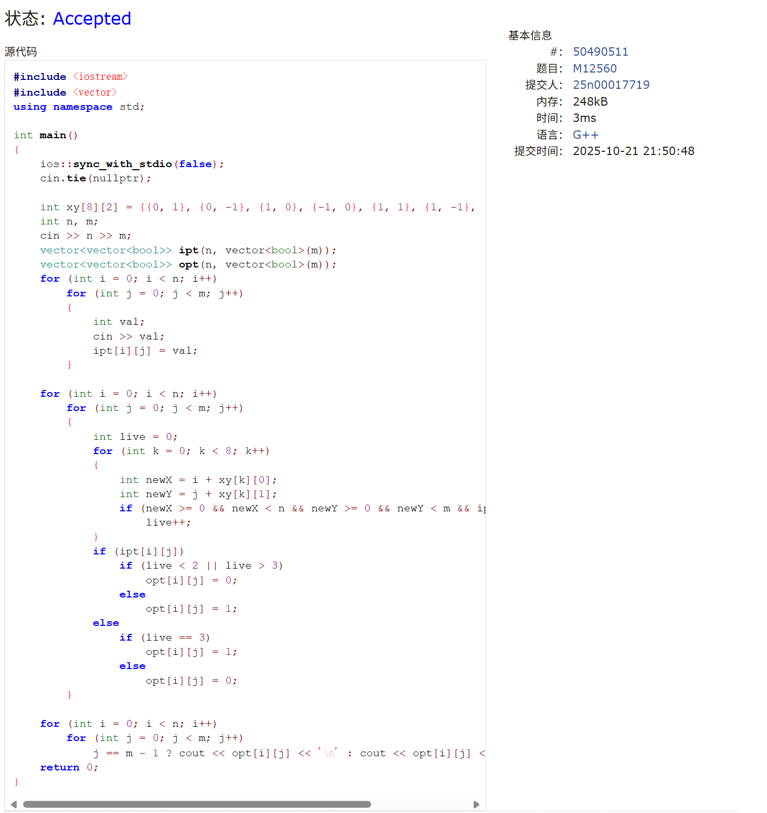


### M04133:垃圾炸弹

matrices, http://cs101.openjudge.cn/pctbook/M04133/

思路：二维前缀和，dp


代码

```cpp
#include <iostream>
#include <vector>
#include <algorithm>
#include <cmath>
using namespace std;

int main()
{
    ios::sync_with_stdio(false);
    cin.tie(nullptr);

    int d, n, minN = 0, maxN = 1e9;
    cin >> d;
    static long long matrix[1025][1025] = {0};
    cin >> n;
    for (int i = 0; i < n; i++)
    {
        int x, y;
        cin >> x >> y;
        cin >> matrix[x][y];
    }

    static long long sum[1026][1026] = {0};
    for (int i = 0; i < 1025; i++)
        for (int j = 0; j < 1025; j++)
            sum[i + 1][j + 1] = matrix[i][j] + sum[i + 1][j] + sum[i][j + 1] - sum[i][j];
    long long best = 0;
    int cnt = 0;
    for (int i = 0; i < 1025; i++)
        for (int j = 0; j < 1025; j++)
        {
            int r1 = max(0, i - d);
            int r2 = min(1024, i + d);
            int c1 = max(0, j - d);
            int c2 = min(1024, j + d);
            long long a = sum[r2 + 1][c2 + 1] - sum[r1][c2 + 1] - sum[r2 + 1][c1] + sum[r1][c1];
            if (a > best)
            {
                best = a;
                cnt = 1;
            }
            else if (a == best)
                cnt++;
        }

    cout << cnt << ' ' << best << endl;
    return 0;
}
```
>共用时1h


代码运行截图 <mark>（至少包含有"Accepted"）</mark>


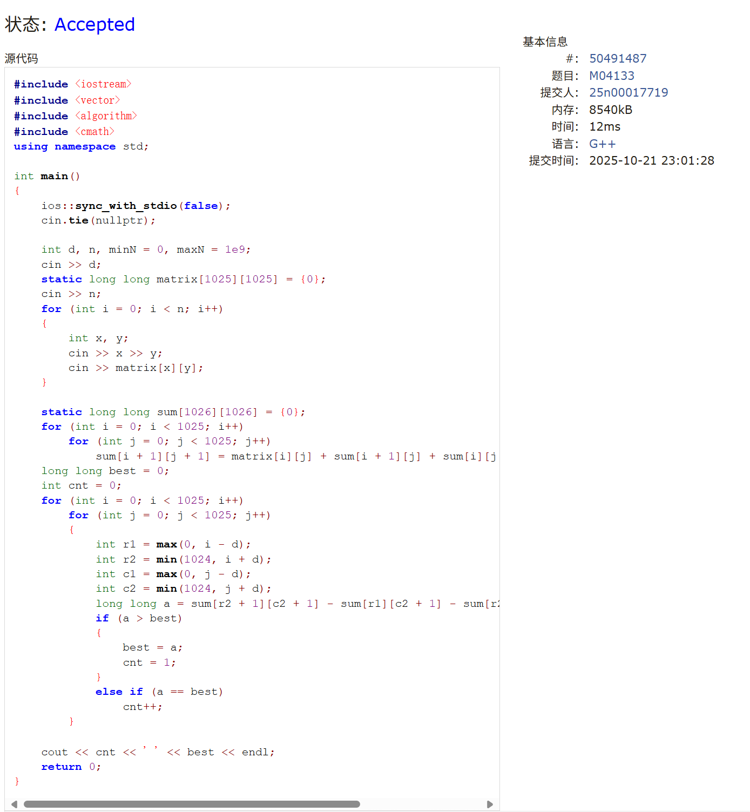


### M02746: 约瑟夫问题

implementation, queue, http://cs101.openjudge.cn/pctbook/M02746/

思路：


代码

```cpp
#include <iostream>
#include <queue>
using namespace std;

int main()
{
    int n, m;
    while (true)
    {
        cin >> n >> m;
        if (n == 0 && m == 0)
            break;
        queue<int> q;
        for (int i = 1; i <= n; i++)
            q.push(i);
        int flag = 1;
        while (q.size() > 1)
        {
            if (flag >= m)
            {
                q.pop();
                flag = 1;
            }
            else
            {
                int tmp = q.front();
                q.pop();
                q.push(tmp);
                flag++;
            }
        }
        cout << q.front() << endl;
    }
    return 0;
}
```
>共用时10min


代码运行截图 <mark>（至少包含有"Accepted"）</mark>


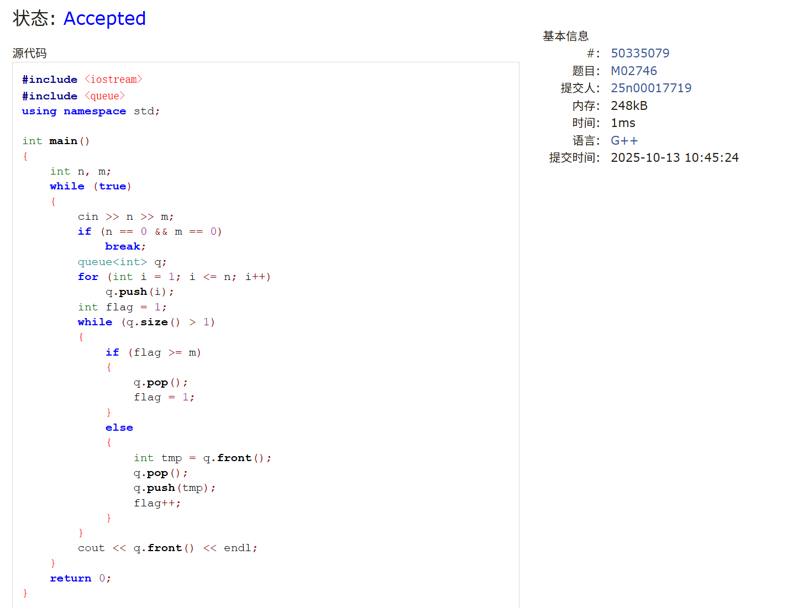


### M26976:摆动序列

greedy, http://cs101.openjudge.cn/pctbook/M26976/


思路：


代码

```cpp
#include <iostream>
#include <vector>
using namespace std;

int main()
{
    ios::sync_with_stdio(false);
    cin.tie(nullptr);

    int n;
    cin >> n;
    vector<int> arr;
    for (int i = 0; i < n; i++)
    {
        int tmp;
        cin >> tmp;
        arr.push_back(tmp);
    }
    
    int cnt = 1;
    int flag = 0;
    for (int i = 1; i < n; i++)
    {
        int diff = arr[i] - arr[i - 1];
        if (diff > 0 && flag <= 0)
        {
            cnt++;
            flag = 1;
        }
        if (diff < 0 && flag >= 0)
        {
            cnt++;
            flag = -1;
        }
    }

    cout << cnt << '\n';
    return 0;
}
```

>共用时20min

代码运行截图 <mark>（至少包含有"Accepted"）</mark>

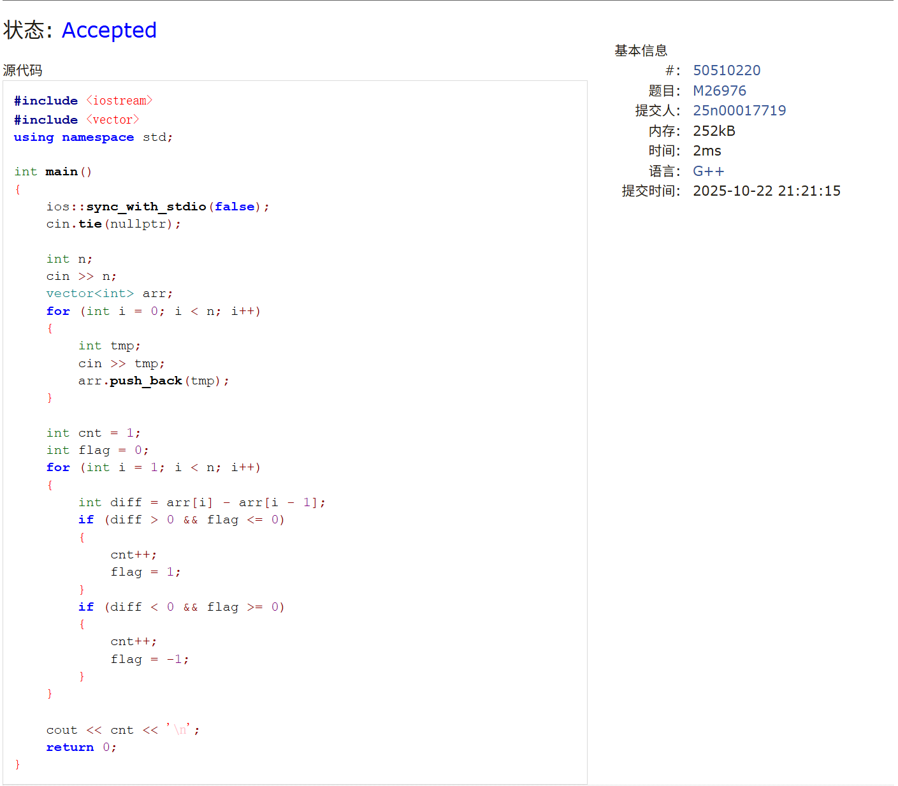


### T26971:分发糖果

greedy, http://cs101.openjudge.cn/pctbook/T26971/

思路：


代码
```cpp
//一遍遍历法，比较脆弱，容易在复杂模式（长下降段、相等值交错等）出错。LeetCode题解测试数据取巧了
#include <iostream>
#include <vector>
using namespace std;

int main()
{
    ios::sync_with_stdio(false);
    cin.tie(nullptr);

    int n;
    cin >> n;
    vector<int> ratings(n);
    for (int i = 0; i < n; i++)
        cin >> ratings[i];
    
    int pre;
    int candies = 1;
    pre = 1;
    int dec = 0, cnt = 1;
    for (int i = 1; i < n; i++)
    {
        if (ratings[i] >= ratings[i - 1])
        {
            cnt = 0;
            pre = ratings[i] == ratings[i - 1] ? 1 : pre + 1;
            candies += pre;
            dec = pre;
        }
        else
        {
            cnt++;
            if (dec == cnt)
                cnt++;
            candies += cnt;
            pre = 1;
        }
    }

    cout << candies << '\n';
    return 0;
}
//两遍遍历法，最稳定
#include <iostream>
#include <vector>
using namespace std;

int main()
{
    ios::sync_with_stdio(false);
    cin.tie(nullptr);

    int n;
    cin >> n;
    vector<int> ratings(n);
    for (int i = 0; i < n; ++i)
        cin >> ratings[i];

    vector<int> left(n, 1);
    for (int i = 1; i < n; ++i)
    {
        if (ratings[i] > ratings[i - 1])
            left[i] = left[i - 1] + 1;
    }

    long long ans = 0;
    int right_len = 1;
    for (int i = n - 1; i >= 0; --i)
    {
        if (i < n - 1 && ratings[i] > ratings[i + 1])
            right_len += 1;
        else
            right_len = 1;
        ans += max(left[i], right_len);
    }

    cout << ans << '\n';
    return 0;
}
```
>共用时1h


代码运行截图 <mark>（至少包含有"Accepted"）</mark>
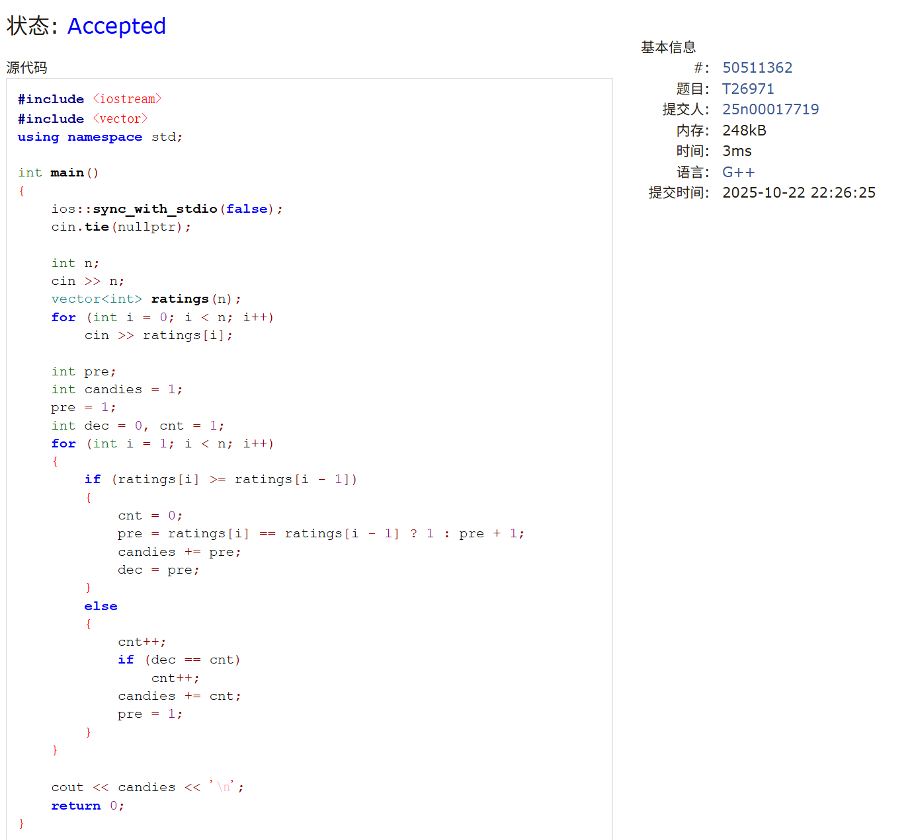

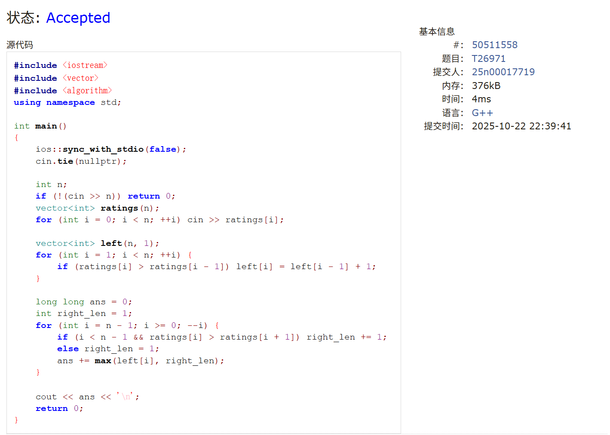


### 1868A. Fill in the Matrix

constructive algorithms, implementation, 1300, https://codeforces.com/problemset/problem/1868/A

思路：


代码

```cpp
#include <iostream>
#include <vector>
using namespace std;

int main()
{
    ios::sync_with_stdio(false);
    cin.tie(nullptr);

    int t;
    cin >> t;
    while (t--)
    {
        int n, m;
        cin >> n >> m;

        if (m == 1)
        {
            cout << 0 << '\n';
            for (int i = 0; i < n; i++)
                cout << 0 << '\n';
            continue;
        }

        vector<vector<int>> M(n, vector<int>(m));
        vector<int> nums;
        for (int i = 0; i < n; i++)
        {
            int it = i % (m - 1);
            int round = 0;
            while (round != m)
            {
                M[i][round] = it;
                round++;
                ++it %= m;
            }
        }
        int max = 0;
        for (int i = 0; i < m; i++)
        {
            vector<bool> exist(m, 0);
            for (int j = 0; j < n; j++)
                exist[M[j][i]] = true;
            for (int i = 0; i < m; i++)
                if (!exist[i])
                {
                    max = max > i ? max : i;
                    break;
                }
        }

        cout << max + 1 << '\n';
        for (int i = 0; i < n; i++)
            for (int j = 0; j < m; j++)
                j != m - 1 ? cout << M[i][j] << ' ' : cout << M[i][j] << '\n';
    }
    return 0;
}
```

>共用时1h


代码运行截图 <mark>（至少包含有"Accepted"）</mark>

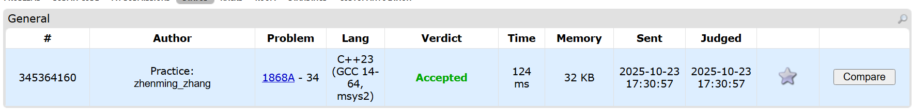


## 2. 学习总结和收获

<mark>如果作业题目简单，有否额外练习题目，比如：OJ“计概2025fall每日选做”、CF、LeetCode、洛谷等网站题目。</mark>

### LeetCode 3
```cpp
#include <iostream>
#include <vector>
#include <set>
using namespace std;

int main()
{
    ios::sync_with_stdio(false);
    cin.tie(nullptr);

    string s;
    cin >> s;

    int cnt[128]{};
    int ans = 0, n = s.size();
    for (int l = 0, r = 0; r < n; ++r)
    {
        ++cnt[s[r]];
        while (cnt[s[r]] > 1)
        {
            --cnt[s[l++]];
        }
        ans = max(ans, r - l + 1);
    }

    cout << ans << '\n';
    return 0;
}
```
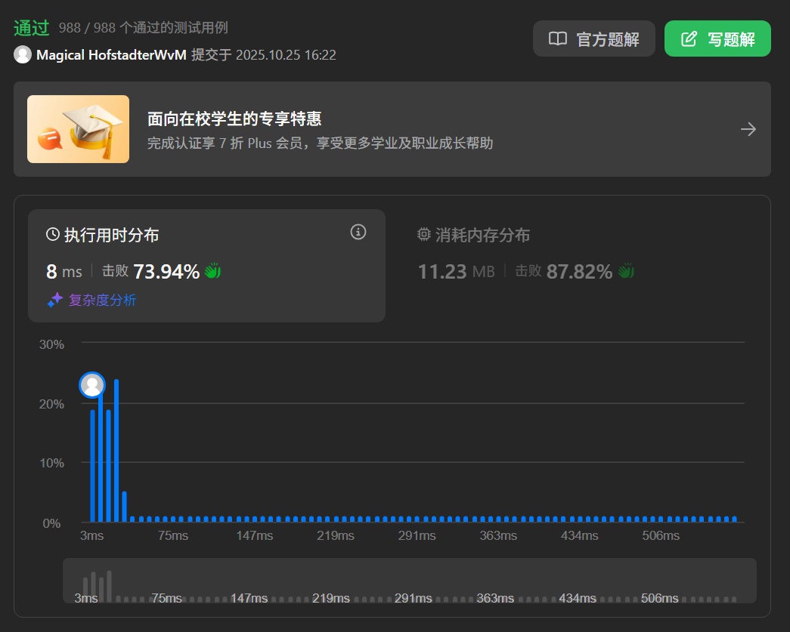

### M01852
```cpp
#include <iostream>
#include <cmath>
using namespace std;

int main()
{
    ios::sync_with_stdio(false);
    cin.tie(nullptr);

    int n;
    cin >> n;
    while (n--)
    {
        int length;
        int ants;
        cin >> length >> ants;
        int maxP = 0, minP = 0;
        while (ants--)
        {
            int pos;
            cin >> pos;
            int dismax = max(pos, length - pos);
            int dismin = min(pos, length - pos);
            maxP = maxP > dismax ? maxP : dismax;
            minP = minP > dismin ? minP : dismin;
        }
        cout << minP << ' ' << maxP << '\n';
    }
    return 0;
}
```
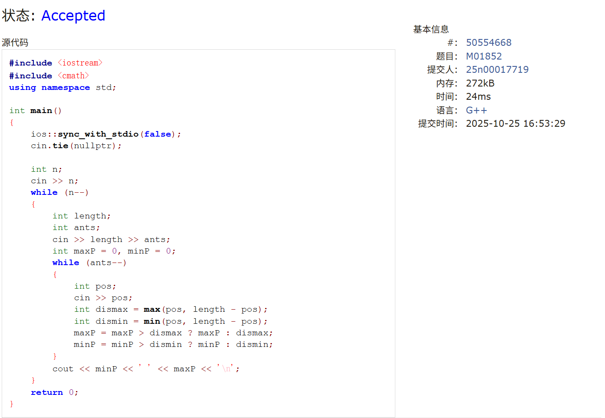

### 49
```cpp
#include <iostream>
#include <vector>
#include <map>
#include <array>
using namespace std;

int main()
{
    ios::sync_with_stdio(false);
    cin.tie(nullptr);
    vector<string> strs;
    string str;
    while (cin >> str)
        strs.push_back(str);
    
    map<array<int,128>, vector<string>> Hmap;
    for (auto &i : strs)
    {
        array<int,128> dic{};
        for (auto j : i)
            dic[j]++;
        Hmap[dic].push_back(i);
    }

    vector<vector<string>> aStrs;
    for (auto i : Hmap)
        aStrs.push_back(i.second);
    return 0;
}
```


### 128
```cpp
#include <iostream>
#include <vector>
#include <unordered_set>
using namespace std;

int main()
{
    int n;
    vector<int> nums;
    while (cin >> n)
        nums.push_back(n);
    
    unordered_set<int> nums_set(nums.begin(), nums.end());
    int maxLen = 0;
    for (auto num : nums_set)
        if (!nums_set.count(num - 1))
        {
            int curr = num;
            int currLen = 1;
            while (nums_set.count(curr + 1))
            {
                curr++;
                currLen++;
            }
            maxLen = maxLen > currLen ? maxLen : currLen;
        }
    
    cout << maxLen << '\n';
    return 0;
}
```

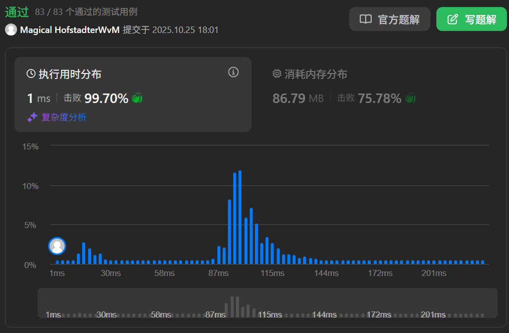

### 2140B
```cpp
#include <iostream>
using namespace std;

int main()
{
    ios::sync_with_stdio(false);
    cin.tie(nullptr);

    int n;
    cin >> n;
    while (n--)
    {
        long long ipt;
        cin >> ipt;
        cout << 2 * ipt << '\n';
    }
    return 0;
}
```
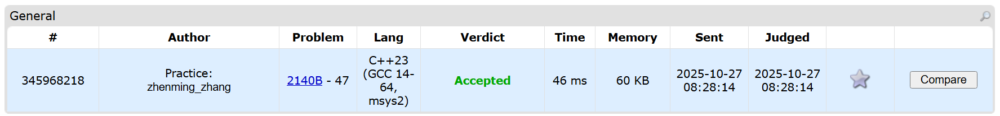

### 189A
```cpp
#include <iostream>
#include <vector>
using namespace std;

int main()
{
    ios::sync_with_stdio(false);
    cin.tie(nullptr);

    int n;
    int a, b, c;
    cin >> n >> a >> b >> c;

    vector<int> dp(n + 1, -1000000000);
    dp[0] = 0;
    for (int i = 1; i <= n; i++)
    {
        if (i >= a) dp[i] = max(dp[i], dp[i - a] + 1);
        if (i >= b) dp[i] = max(dp[i], dp[i - b] + 1);
        if (i >= c) dp[i] = max(dp[i], dp[i - c] + 1);
    }
    
    cout << dp[n] << '\n';
    return 0;
}
```

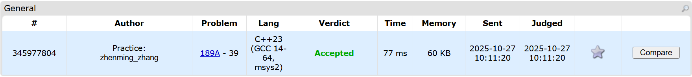

### E02942
```cpp
#include <iostream>
#include <vector>
using namespace std;

int main()
{
    int N;
    cin >> N;

    vector<int> dp(N + 2);
    dp[0] = 0, dp[1] = 1, dp[2] = 2;
    for (int i = 3; i <= N; i++)
        dp[i] = dp[i - 1] + dp[i - 2];
    
    cout << dp[N] << '\n';
    return 0;
}
```

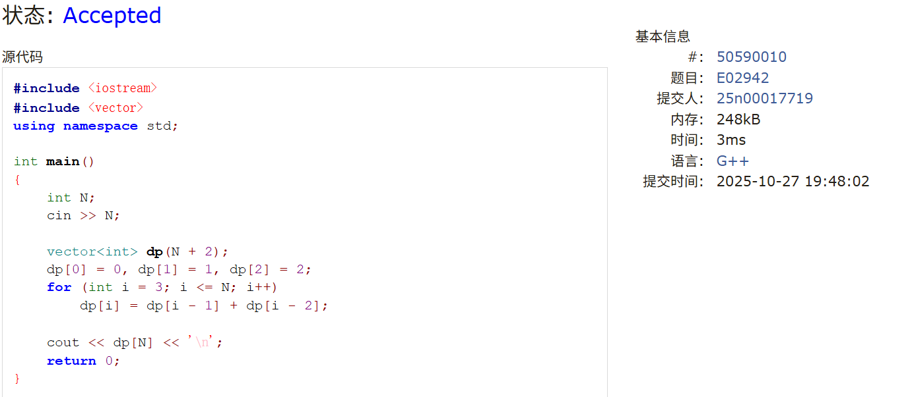

### M29952
```cpp
#include <iostream>
#include <stack>
using namespace std;

int main()
{
    ios::sync_with_stdio(false);
    cin.tie(nullptr);

    string s;
    cin >> s;

    stack<int> st;
    int maxLen = 0;
    st.push(-1);
    for (int i = 0; i < s.length(); i++)
    {
        if (s[i] == '(')
            st.push(i);
        else
        {
            st.pop();
            if (st.empty())
                st.push(i);
            else
                maxLen = max(maxLen, i - st.top());
        }
    }

    cout << maxLen << '\n';
    return 0;
}
```
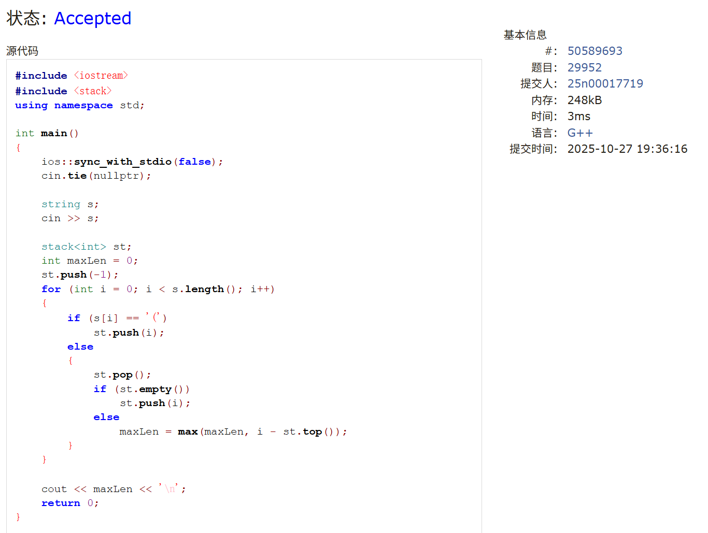

### 121
```cpp
#include <iostream>
#include <vector>
using namespace std;

int maxProfit_Greedy(vector<int>& prices)
{
    int minPrice = 1e9, maxN = 0;
    for (auto i : prices)
    {
        minPrice = min(minPrice, i);
        maxN = max(maxN, i - minPrice);
    }
    return maxN;
}

int maxProfit_DP(vector<int>& prices)
{
    if (prices.size() == 1)
        return 0;
    vector<int> sub;
    for (int i = 0; i < prices.size() - 1; i++)
        sub.push_back(prices[i + 1] - prices[i]);
    vector<int> dp(prices.size());
    dp[0] = sub[0];
    int maxN = max(0, dp[0]);
    for (int i = 1; i < dp.size(); i++)
    {
        dp[i] = max(0, dp[i - 1]) + sub[i];
        maxN = max(maxN, dp[i]); 
    }
    return maxN;
}

int main()
{
    vector<int> prices;
    int n;
    while (cin >> n)
        prices.push_back(n);
    cout << maxProfit_DP(prices) << '\n';
    return 0;
}
```

