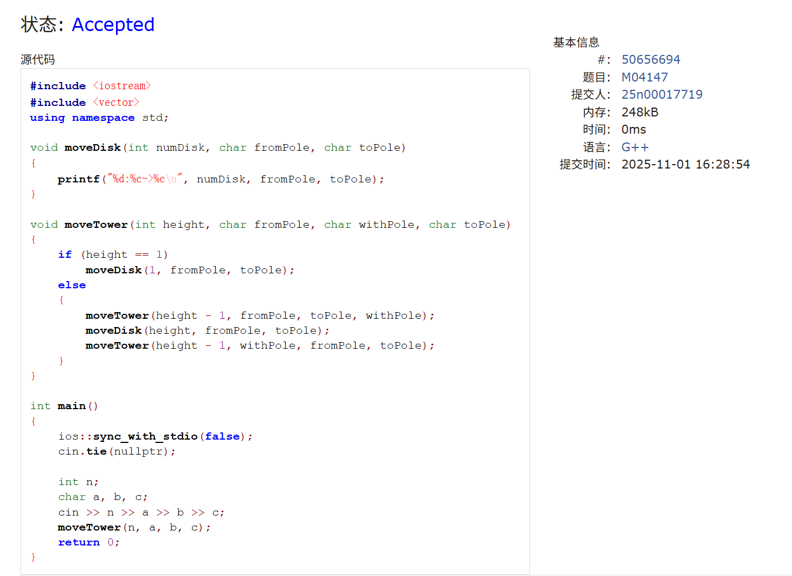
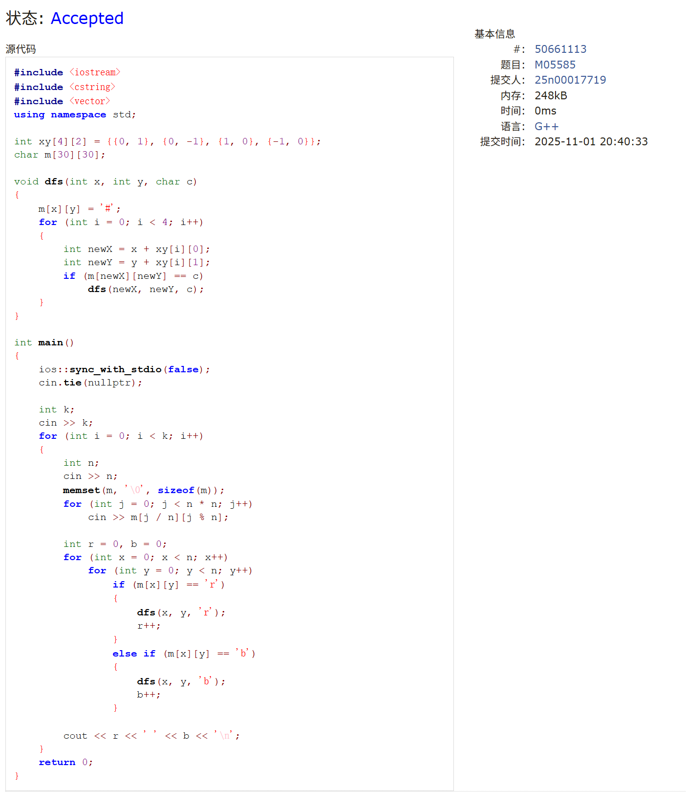
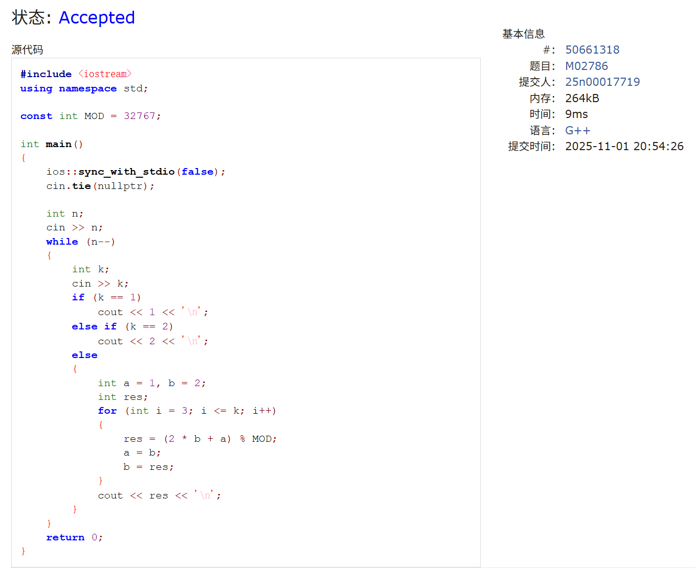
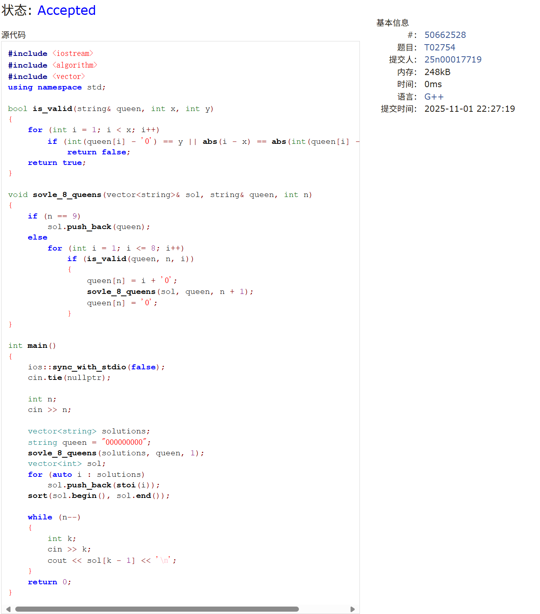
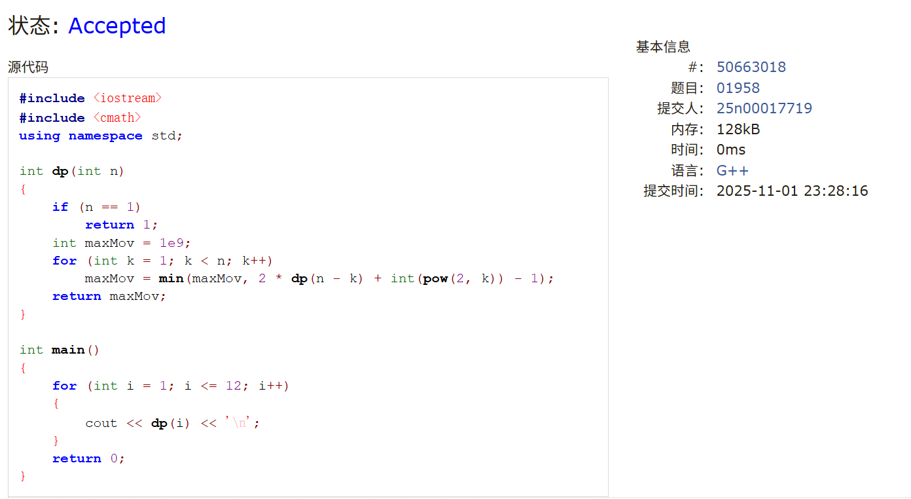
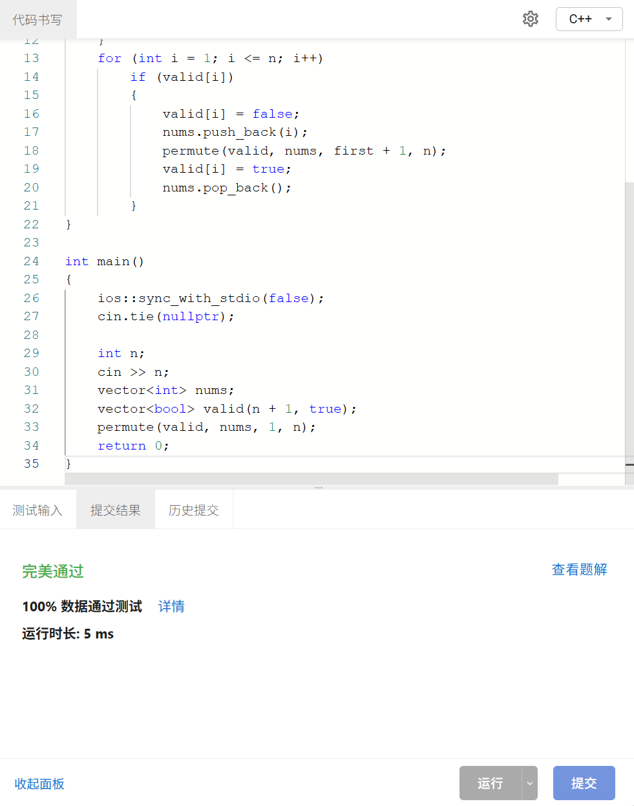
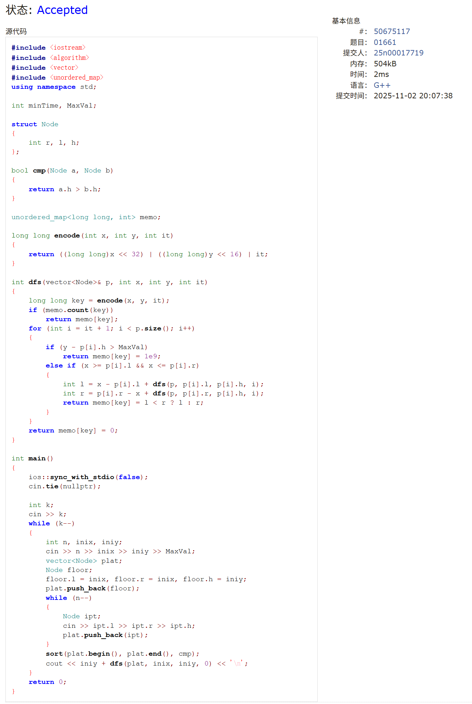

# Assignment #8: 递归

Updated 1315 GMT+8 Oct 21, 2025

2025 fall, Complied by <mark>张真铭 元培学院</mark>


>**说明：**
>
>1. **解题与记录：**
>
>  对于每一个题目，请提供其解题思路（可选），并附上使用Python或C++编写的源代码（确保已在OpenJudge， Codeforces，LeetCode等平台上获得Accepted）。请将这些信息连同显示“Accepted”的截图一起填写到下方的作业模板中。（推荐使用Typora https://typoraio.cn 进行编辑，当然你也可以选择Word。）无论题目是否已通过，请标明每个题目大致花费的时间。
>
>2. 提交安排：**提交时，请首先上传PDF格式的文件，并将.md或.doc格式的文件作为附件上传至右侧的“作业评论”区。确保你的Canvas账户有一个清晰可见的本人头像，提交的文件为PDF格式，并且“作业评论”区包含上传的.md或.doc附件。
> 
>4. **延迟提交：**如果你预计无法在截止日期前提交作业，请提前告知具体原因。这有助于我们了解情况并可能为你提供适当的延期或其他帮助。  
>
>请按照上述指导认真准备和提交作业，以保证顺利完成课程要求。


## 1. 题目

### M04147汉诺塔问题(Tower of Hanoi)

dfs, http://cs101.openjudge.cn/pctbook/M04147

思路：


代码

```cpp
#include <iostream>
#include <vector>
using namespace std;

void moveDisk(int numDisk, char fromPole, char toPole)
{
    printf("%d:%c->%c\n", numDisk, fromPole, toPole);
}

void moveTower(int height, char fromPole, char withPole, char toPole)
{
    if (height == 1)
        moveDisk(1, fromPole, toPole);
    else
    {
        moveTower(height - 1, fromPole, toPole, withPole);
        moveDisk(height, fromPole, toPole);
        moveTower(height - 1, withPole, fromPole, toPole);
    }
}

int main()
{
    ios::sync_with_stdio(false);
    cin.tie(nullptr);

    int n;
    char a, b, c;
    cin >> n >> a >> b >> c;
    moveTower(n, a, b, c);
    return 0;
}
```
>共用时20min


代码运行截图 <mark>（至少包含有"Accepted"）</mark>




### M05585: 晶矿的个数

matrices, dfs similar, http://cs101.openjudge.cn/pctbook/M05585

思路：


代码

```cpp
#include <iostream>
#include <cstring>
#include <vector>
using namespace std;

int xy[4][2] = {{0, 1}, {0, -1}, {1, 0}, {-1, 0}};
char m[30][30];

void dfs(int x, int y, char c)
{
    m[x][y] = '#';
    for (int i = 0; i < 4; i++)
    {
        int newX = x + xy[i][0];
        int newY = y + xy[i][1];
        if (m[newX][newY] == c)
            dfs(newX, newY, c);
    }
}

int main()
{
    ios::sync_with_stdio(false);
    cin.tie(nullptr);

    int k;
    cin >> k;
    for (int i = 0; i < k; i++)
    {
        int n;
        cin >> n;
        memset(m, '\0', sizeof(m));
        for (int j = 0; j < n * n; j++)
            cin >> m[j / n][j % n];
        
        int r = 0, b = 0;
        for (int x = 0; x < n; x++)
            for (int y = 0; y < n; y++)
                if (m[x][y] == 'r')
                {
                    dfs(x, y, 'r');
                    r++;
                }
                else if (m[x][y] == 'b')
                {
                    dfs(x, y, 'b');
                    b++;
                }
        
        cout << r << ' ' << b << '\n';
    }
    return 0;
}
```
>共用时30min


代码运行截图 <mark>（至少包含有"Accepted"）</mark>




### M02786: Pell数列

dfs, dp, http://cs101.openjudge.cn/pctbook/M02786/

思路：


代码

```cpp
#include <iostream>
using namespace std;

const int MOD = 32767;

int main()
{
    ios::sync_with_stdio(false);
    cin.tie(nullptr);

    int n;
    cin >> n;
    while (n--)
    {
        int k;
        cin >> k;
        if (k == 1)
            cout << 1 << '\n';
        else if (k == 2)
            cout << 2 << '\n';
        else
        {
            int a = 1, b = 2;
            int res;
            for (int i = 3; i <= k; i++)
            {
                res = (2 * b + a) % MOD;
                a = b;
                b = res;
            }
            cout << res << '\n';
        }
    }
    return 0;
}
```

>共用时5min

代码运行截图 <mark>（至少包含有"Accepted"）</mark>




### M46.全排列

backtracking, https://leetcode.cn/problems/permutations/


思路：


代码

```cpp
#include <iostream>
#include <vector>
using namespace std;

void permutation(vector<vector<int>>& res, vector<int>& nums, int first, int len)
{
    if (first == len)
    {
        res.emplace_back(nums);
        return;
    }
    for (int i = first; i < len; i++)
    {
        swap(nums[i], nums[first]);
        permutation(res, nums, first + 1, len);
        swap(nums[i], nums[first]);
    }
}

vector<vector<int>> permute(vector<int>& nums)
{
    vector<vector<int>> res;
    permutation(res, nums, 0, nums.size());
    return res;
}

int main()
{
    ios::sync_with_stdio(false);
    cin.tie(nullptr);

    vector<int> nums;
    int ipt;
    while (cin >> ipt)
        nums.push_back(ipt);
    vector<vector<int>> ans = permute(nums);
    for (auto i : ans)
    {
        for (auto j : i)
            cout << j << ' ';
        cout << '\n';
    }
    return 0;
}
```

>共用时1h

代码运行截图 <mark>（至少包含有"Accepted"）</mark>


### T02754: 八皇后

dfs and similar, http://cs101.openjudge.cn/pctbook/T02754

思路：


代码

```cpp
#include <iostream>
#include <algorithm>
#include <vector>
using namespace std;

bool is_valid(string& queen, int x, int y)
{
    for (int i = 1; i < x; i++)
        if (int(queen[i] - '0') == y || abs(i - x) == abs(int(queen[i] - '0') - y))
            return false;
    return true;
}

void sovle_8_queens(vector<string>& sol, string& queen, int n)
{
    if (n == 9)
        sol.push_back(queen);
    else
        for (int i = 1; i <= 8; i++)
            if (is_valid(queen, n, i))
            {
                queen[n] = i + '0';
                sovle_8_queens(sol, queen, n + 1);
                queen[n] = '0';
            }
}

int main()
{
    ios::sync_with_stdio(false);
    cin.tie(nullptr);

    int n;
    cin >> n;

    vector<string> solutions;
    string queen = "000000000";
    sovle_8_queens(solutions, queen, 1);
    vector<int> sol;
    for (auto i : solutions)
        sol.push_back(stoi(i));
    sort(sol.begin(), sol.end());

    while (n--)
    {
        int k;
        cin >> k;
        cout << sol[k - 1] << '\n';
    }
    return 0;
}
```
>共用时1h30min


代码运行截图 <mark>（至少包含有"Accepted"）</mark>




### T01958 Strange Towers of Hanoi

http://cs101.openjudge.cn/practice/01958/

思路：


代码

```cpp
#include <iostream>
#include <cmath>
using namespace std;

int dp(int n)
{
    if (n == 1)
        return 1;
    int maxMov = 1e9;
    for (int k = 1; k < n; k++)
        maxMov = min(maxMov, 2 * dp(n - k) + int(pow(2, k)) - 1);
    return maxMov;
}

int main()
{
    for (int i = 1; i <= 12; i++)
        cout << dp(i) << '\n';
    return 0;
}
```

>共用时30min

代码运行截图 <mark>（至少包含有"Accepted"）</mark>




## 2. 学习总结和收获

<mark>如果作业题目简单，有否额外练习题目，比如：OJ“计概2025fall每日选做”、CF、LeetCode、洛谷等网站题目。</mark>

### sy132
```cpp
#include <iostream>
#include <vector>
using namespace std;

void permute(vector<bool>& valid, vector<int>& nums, int first, int n)
{
    if (first == n + 1)
    {
        for (int i = 0; i < n; i++)
            i < n - 1 ? cout << nums[i] << ' ' : cout << nums[i] << '\n';
        return;
    }
    for (int i = 1; i <= n; i++)
        if (valid[i])
        {
            valid[i] = false;
            nums.push_back(i);
            permute(valid, nums, first + 1, n);
            valid[i] = true;
            nums.pop_back();
        }
}

int main()
{
    ios::sync_with_stdio(false);
    cin.tie(nullptr);

    int n;
    cin >> n;
    vector<int> nums;
    vector<bool> valid(n + 1, true);
    permute(valid, nums, 1, n);
    return 0;
}
```


### 01661
http://cs101.openjudge.cn/practice/01661/
做了4-5h才完全搞明白这道题......
一开始忘记考虑```y - p[i].h > MaxVal```时的返回值了，导致返回的是默认值0，在这里卡了很久，也就是说它作为一个单纯的DFS题就已经不是很容易了，结果写完以后发现超时了，做了剪枝之后发现还是超时，然后就借助ai得知了记忆化搜索这个工具，然后又在key上面卡了好久，最后还是写出来了。
```cpp
#include <iostream>
#include <algorithm>
#include <vector>
#include <unordered_map>
using namespace std;

int minTime, MaxVal;

struct Node
{
    int r, l, h;
};

bool cmp(Node a, Node b)
{
    return a.h > b.h;
}

unordered_map<long long, int> memo;

long long encode(int x, int y, int it)
{
    return ((long long)x << 32) | ((long long)y << 16) | it;
}

int dfs(vector<Node>& p, int x, int y, int it)
{
    long long key = encode(x, y, it);
    if (memo.count(key))
        return memo[key];
    for (int i = it + 1; i < p.size(); i++)
    {
        if (y - p[i].h > MaxVal)
            return memo[key] = 1e9;
        else if (x >= p[i].l && x <= p[i].r)
        {
            int l = x - p[i].l + dfs(p, p[i].l, p[i].h, i);
            int r = p[i].r - x + dfs(p, p[i].r, p[i].h, i);
            return memo[key] = l < r ? l : r;
        }
    }
    return memo[key] = 0;
}

int main()
{
    ios::sync_with_stdio(false);
    cin.tie(nullptr);

    int k;
    cin >> k;
    while (k--)
    {
        int n, inix, iniy;
        cin >> n >> inix >> iniy >> MaxVal;
        vector<Node> plat;
        Node floor;
        floor.l = inix, floor.r = inix, floor.h = iniy;
        plat.push_back(floor);
        while (n--)
        {
            Node ipt;
            cin >> ipt.l >> ipt.r >> ipt.h;
            plat.push_back(ipt);
        }
        sort(plat.begin(), plat.end(), cmp);
        cout << iniy + dfs(plat, inix, iniy, 0) << '\n';
    }
    return 0;
}
```


### LeetCode 20
```cpp
#include <iostream>
#include <stack>
using namespace std;

bool isValid(string s)
{
    stack<char> st;
    for (auto i : s)
    {
        if (i == '(' || i == '[' || i == '{')
            st.push(i);
        else
            if (!st.empty() && i == ')' && st.top() == '(')
                st.pop();
            else if (!st.empty() && i == ']' && st.top() == '[')
                st.pop();
            else if (!st.empty() && i == '}' && st.top() == '{')
                st.pop();
            else
                return false;
    }
    if (st.empty())
        return true;
    else
        return false;
}

int main()
{
    string s;
    cin >> s;
    cout << isValid(s) << '\n';
    return 0;
}
```


### LeetCode 78
```cpp
#include <iostream>
#include <vector>
using namespace std;

void dfs(vector<int> nums, vector<vector<int>>& subsets, vector<int> t)
{
    if (nums.empty())
    {
        subsets.push_back(t);
        return;
    }
    t.push_back(nums[0]);
    nums.erase(nums.begin());
    dfs(nums, subsets, t);
    t.pop_back();
    dfs(nums, subsets, t);
}

vector<vector<int>> subsets(vector<int>& nums)
{
    vector<vector<int>> subsets;
    vector<int> t;
    dfs(nums, subsets, t);
    return subsets;
}

int main()
{
    ios::sync_with_stdio(false);
    cin.tie(nullptr);

    vector<int> nums = {1, 2, 3};
    for (auto i : subsets(nums))
    {
        for (auto j : i)
            cout << j << ' ';
        cout << '\n';
    }
    return 0;
}
```


### LeetCode 131
```cpp
#include <iostream>
#include <algorithm>
#include <vector>
using namespace std;

vector<vector<string>> ans;
vector<string> t;

bool is_Valid(string s)
{
    string tmp = s;
    reverse(s.begin(), s.end());
    return tmp == s;
}

void backtrack(int curr, string& s)
{
    if (curr == s.length())
    {
        ans.push_back(t);
        return;
    }
    for (int i = 1; i <= s.length() - curr; i++)
    {
        string subs = s.substr(curr, i);
        if (is_Valid(subs))
        {
            t.push_back(subs);
            backtrack(curr + i, s);
            t.pop_back();
        }
    }
}

vector<vector<string>> partition(string s)
{
    backtrack(0, s);
    return ans;
}

int main()
{
    ios::sync_with_stdio(false);
    cin.tie(nullptr);

    string s = "aab";
    for (auto i : partition(s))
    {
        for (auto j : i)
            cout << j << ' ';
        cout << '\n';
    }
    return 0;
}
```


### LeetCode 51
```cpp
#include <iostream>
#include <vector>
using namespace std;

vector<int> row;

bool is_Valid(int x, int y)
{
    for (int i = 0; i < x; i++)
        if (row[i] == y || abs(x - i) == abs(y - row[i]))
            return false;
    return true;
}

void solve(int n, vector<vector<string>>& q, int x)
{
    if (x == n)
    {
        vector<string> tmp(n, string(n, '.'));
        for (int i = 0; i < row.size(); i++)
            tmp[i][row[i]] = 'Q';
        q.push_back(tmp);
        return;
    }
    for (int i = 0; i < n; i++)
        if (is_Valid(x, i))
        {
            row.push_back(i);
            solve(n, q, x + 1);
            row.pop_back();
        }
}

vector<vector<string>> solveNQueens(int n)
{
    vector<vector<string>> ans;
    solve(n, ans, 0);
    return ans;
}

int main()
{
    ios::sync_with_stdio(false);
    cin.tie(nullptr);

    int n = 4;
    for (auto i : solveNQueens(n))
    {
        for (auto j : i)
            cout << j << ' ';
        cout << '\n';
    }
    return 0;
}
```

